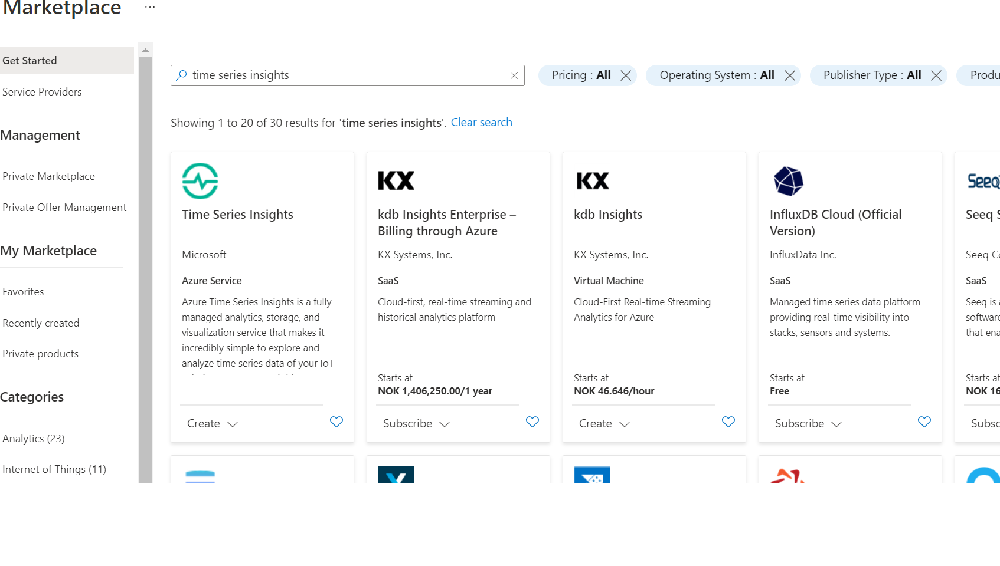
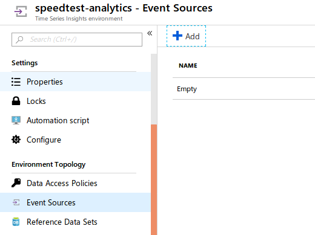
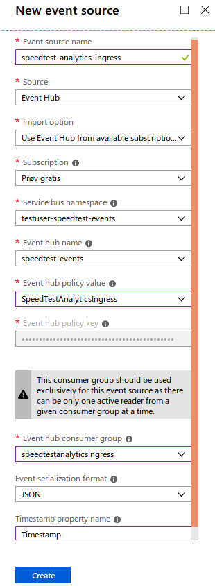
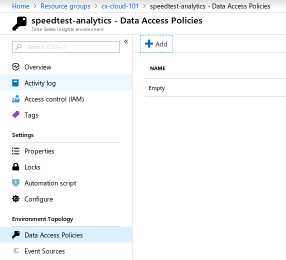
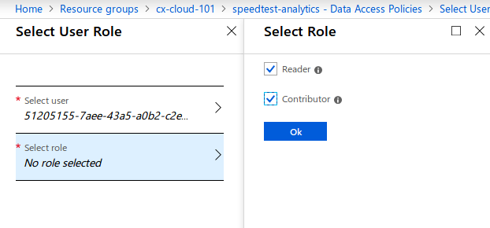

[Home](../) > [Azure](index) > Adding Analytics
===============================================
_When needing to analyze data, its often worth having a quick look after suitable BI-tools instead of implementing a custom application. In this section we'll visualize speedtests using [Time Series Insights](https://docs.microsoft.com/en-us/azure/time-series-insights/time-series-insights-overview)._

Creating Time Series Insights
-----------------------------
Log on to [portal.azure.com](https://portal.azure.com), navigate to the cx-cloud-101 resource group, and add a new "Time Series Insights" resource.

Name the environment speedtest-analytics and use the existing resource group cx-cloud-101.

While it's creating, open speedtest-events and add a new [consumer group](https://docs.microsoft.com/en-us/azure/event-hubs/event-hubs-features#consumer-groups) named SpeedTestAnalyticsIngress. In essence, we're telling event hub that there's going to be an application/consumer that'll need it's own view of the events we're publishing.

We should also create a new access policy named SpeedTestAnalyticsIngress for our new Time Series Insights application.

When speedtest-analytics has been created, open it an navigate to "Event Sources".

Add a new event source named speedtest-analytics-ingress. It should use the Event hub policy SpeedTestAnalyticsIngress and speedtestanalyticsingress consumer group that we just created.

Finally we'll have to tell Time Series Insights that our events are JSON-serialized, and that "Timestamp" is the timestamp property.

We also have to configure a data access policy for our data. This is basically a list of users that can access the data stored in Time Series Insights.

Add your own user as a "Reader" and "Contributor".

Finally we can go to the overview page and go to the Time Series Insights environment.

Inside Time Series Insights we can view different properties/measures, grouped by/split by other properties. Try to view Download and Upload by User. We can also mark an area in the graph and view all events related to that section.

Run SpeedTestLogger a couple more times, so you get more data, and play around with the data in Time Series Insights. Explore the data in different ways. Can you create any interesting graphs?

Celebration time!
-----------------
You've now made a completed system for measuring, logging, receiving, storing and analyzing internet speed on Azure. Congratulations!

Fom here on out, you have several options for what to continue with:
* Would you like to be able to schedule and trigger SpeedTestLogger from Azure, and [learn about Service Bus and Logic Apps](scheduling-speedtests)?
* Would you like to turn Console.WriteLine() into proper logging with [Application Insights](application-insights)?
* Would you like to add another consumer-application, store data in Table Storage, and view them in [a webapplication](the-web-page)?
