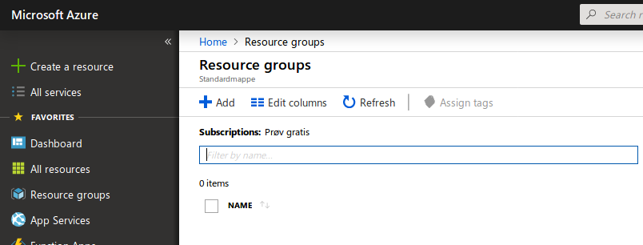
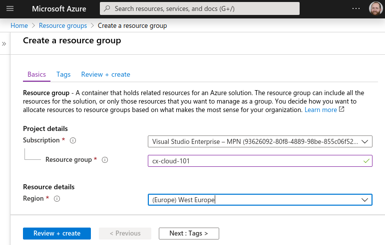
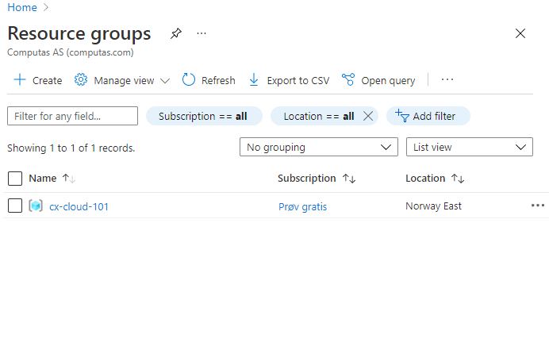
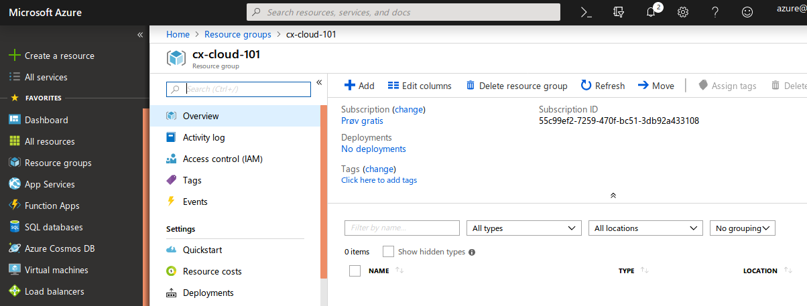
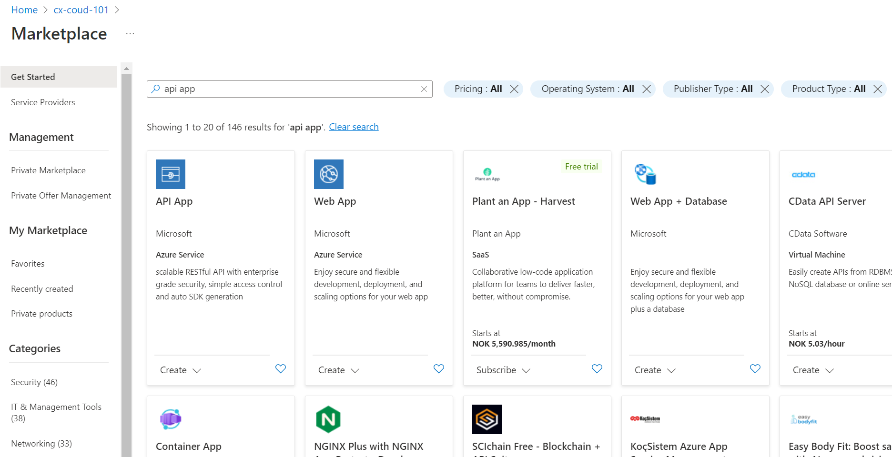
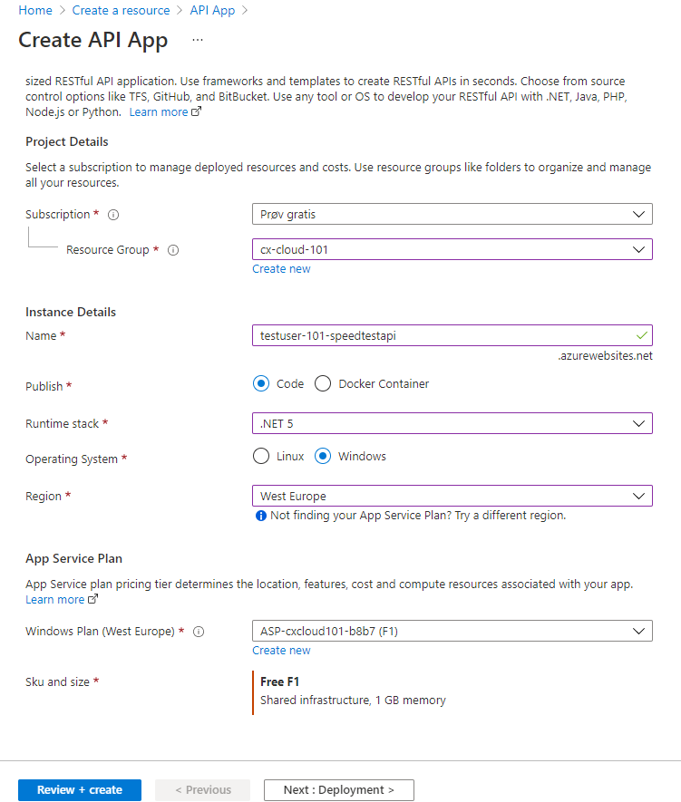
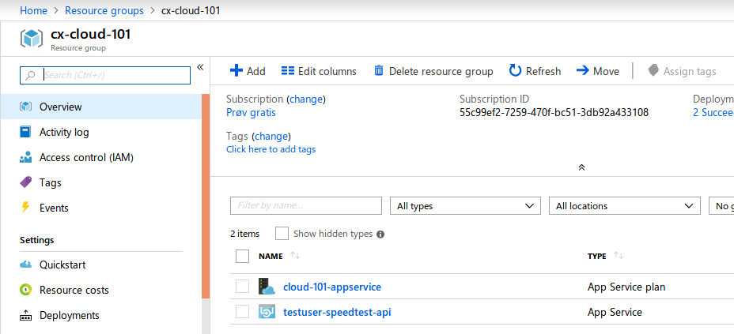
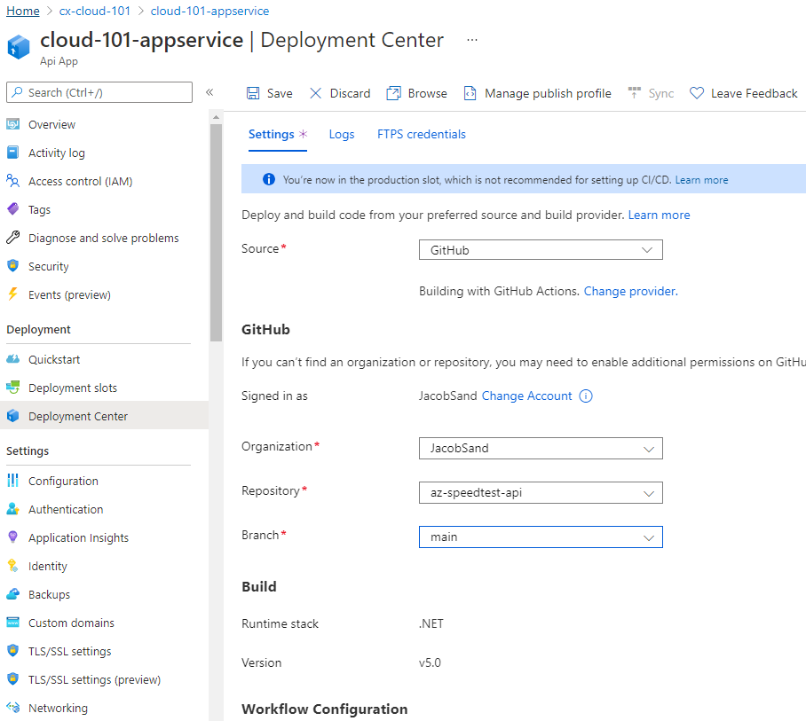

[Home](../) > [Azure](index) > An API for All Things
==========================================================
_How do we get our speedtests up to the cloud? We need an API!_

Create another git repository
-----------------------------
Create a new repository called "az-speedtest-api" as described in the previous section.
Clone the repo, and add a .gitignore-file containing the following:

```
# Build files
**/obj
**/bin

# Development configuration
**/appsettings.Development.json
**/Properties
```

This time we'll ignore a couple more files, since these files usually are used to store development secrets that shouldn't be committed to the repository.

Creating an API
---------------
Now we'll start on creating the API. Move into the `az-speedtest-api/`-folder, and execute the following command to create a new A<span>SP.N</span>ET Core API named SpeedTestApi.

```shell
$> cd az-speedtest-api
$ az-speedtest-api> dotnet new webapi -o SpeedTestApi
The template "ASP.NET Core Web API" was created successfully.

Processing post-creation actions...
Restoring C:\Users\sma\code\az-speedtest-api\SpeedTestApi\SpeedTestApi.csproj:
  Determining projects to restore...
  Restored C:\Users\sma\code\az-speedtest-api\SpeedTestApi\SpeedTestApi.csproj (in 296 ms).
Restore succeeded.
```

Try out your new API by moving into the `SpeedTestApi/`-folder and executing `dotnet run`.

```shell
$ az-speedtest-api> cd SpeedTestApi
$ az-speedtest-api/SpeedTestApi> dotnet run
info: Microsoft.Hosting.Lifetime[0]
      Now listening on: https://localhost:5070
info: Microsoft.Hosting.Lifetime[0]
      Now listening on: http://localhost:7185
info: Microsoft.Hosting.Lifetime[0]
      Application started. Press Ctrl+C to shut down.
info: Microsoft.Hosting.Lifetime[0]
      Hosting environment: Development
info: Microsoft.Hosting.Lifetime[0]
      Content root path: /home/teodoran/cloud-101/testuser/az-speedtest-api/SpeedTestApi
```

_Notice how A<span>SP.N</span>ET Core creates two endpoints? One for http and one for https requests? This is quite useful as it enables https-redirection and http support, but when we develop locally, its definitely easiest to just use the http endpoint._

Open [http://localhost:5070/WeatherForecast](http://localhost:5070/WeatherForecast) in your favorite browser. Notice how we got redirected to [https://localhost:7185/WeatherForecast](https://localhost:7185/WeatherForecast) and that the browser complains about an insecure connection? This is because we're forcing traffic on http to be upgraded to https if possible, but we don't have a valid certificate installed that enables our machine to make a true https connection. Here's one way we can fix this.

Locate the file `Program.cs`. This file contains, among other things, configuration and dependency injection in an A<span>SP.N</span>ET Core API. It's currently executing `app.UseHttpsRedirection();` in both development and production mode, so move this line in an else-statement, so it's only executed when the app is not in development.

```csharp
var builder = WebApplication.CreateBuilder(args);

// Add services to the container.

builder.Services.AddControllers();
// Learn more about configuring Swagger/OpenAPI at https://aka.ms/aspnetcore/swashbuckle
builder.Services.AddEndpointsApiExplorer();
builder.Services.AddSwaggerGen();

var app = builder.Build();

// Configure the HTTP request pipeline.
if (app.Environment.IsDevelopment())
{
    app.UseSwagger();
    app.UseSwaggerUI();
}
else
{
    app.UseHttpsRedirection();
}


app.UseAuthorization();

app.MapControllers();

app.Run();
```

Stop and start SpeedTestApi with `dotnet run`, and open [http://localhost:5070/WeatherForecast](http://localhost:5070/WeatherForecast) again. This can be done with `ctrl + C` if run from the console. Now we're not redircted to https and we don't get any warnings, but we'll still use https-redirection when running in production.

Playing Ping Pong
-----------------
So, we got an API up and running, let's make the famous ping-route!

Start by deleting the `SpeedTestApi/WeatherForecast.cs`-file. We won't be needing that. Then we can rename `SpeedTestApi/Controllers/WeatherForecastController.cs` to `SpeedTestApi/Controllers/SpeedTestController.cs`. Update the class name and constructor name as well, and remove all methods/routes from the class.

```csharp
using Microsoft.AspNetCore.Mvc;

namespace SpeedTestApi.Controllers;

[ApiController]
[Route("[controller]")]
public class SpeedTestController : ControllerBase
{

}
```

_Whats a route? A route is a pattern that matches one or more URL's. Typically the controller has a base-route/path that'll get prefixed to all routes handled by methods in that controller. Then every route-handling method in that controller handles a sub-route/path._

The base route for this controller is `[Route("[controller]")]`. This means that all routes in this controller will start with `speedtest/...`, since that's the name of the controller.

Now we'll add a single route "ping":

```csharp
using Microsoft.AspNetCore.Mvc;

namespace SpeedTestApi.Controllers;

[ApiController]
[Route("[controller]")]
public class SpeedTestController : ControllerBase
{
    // GET speedtest/ping
    [Route("ping")]
    [HttpGet]
    public string Ping()
    {
        return "PONG";
    }
}
```

Now we can test our ping-route. Restart SpeedTestApi, and open [http://localhost:5070/speedtest/ping](http://localhost:5070/speedtest/ping). It should display PONG.


Getting it on GitHub
--------------------
As we did for SpeedTestLogger, commit everything, and push it to GitHub.

```shell
$ az-speedtest-api> git status -u
On branch master
Your branch is up-to-date with 'origin/master'.
Untracked files:
  (use "git add <file>..." to include in what will be committed)

	../.gitignore
	Controllers/SpeedTestController.cs
	Program.cs
	SpeedTestApi.csproj
	Startup.cs
	appsettings.json

nothing added to commit but untracked files present (use "git add" to track)
$ az-speedtest-api> git add --all
$ az-speedtest-api> git commit -m "Added /speedtest/ping"
[master c432a72] Added /speedtest/ping
 6 files changed, 119 insertions(+)
 create mode 100644 .gitignore
 create mode 100644 SpeedTestApi/Controllers/SpeedTestController.cs
 create mode 100644 SpeedTestApi/Program.cs
 create mode 100644 SpeedTestApi/SpeedTestApi.csproj
 create mode 100644 SpeedTestApi/Startup.cs
 create mode 100644 SpeedTestApi/appsettings.json
✔ ~/cloud-101/testuser/az-speedtest-api/SpeedTestApi [master ↑·1|✔]
$ az-speedtest-api> git push origin master
Username for 'https://github.com': cloud-101-testuser
Password for 'https://cloud-101-testuser@github.com':
Counting objects: 10, done.
Delta compression using up to 8 threads.
Compressing objects: 100% (10/10), done.
Writing objects: 100% (10/10), 1.99 KiB | 0 bytes/s, done.
Total 10 (delta 0), reused 0 (delta 0)
To https://github.com/cloud-101-testuser/az-speedtest-api.git
   81e6b02..c432a72  master -> master
```

Getting it on Azure
-------------------
Finally we're getting some Azure action! We're deploying SpeedTestApi to the cloud!

### Creating a Resource Group
Everything on Azure is organized under a resource group. A resource group is a collection of resources, and everything you make on Azure is a resource. Basically it's a way to organize the stuff you make on Azure into more manageable pieces.

A resource group is connected to a subscription, and that's where the money is coming from. It's also where most of the access-control to editing stuff on Azure is done.

A quick example to make this all more concrete. Let's say you're a large organization with two consultancy firms developing Azure applications. You want the two firms to do as they please, but you want to keep track of each firms spending separately. Then you'll create two subscriptions, one for each firm. Within one firm, they might be several teams developing several applications, some that other teams shouldn't be able to edit or view, then they'll create different resource groups with different access restrictions.

We fortunately only need one resource group. Let's create it now.

Log on to [portal.azure.com](https://portal.azure.com), and navigate to "Resource groups".



Press "Add" to create a new resource group. Name it "cx-cloud-101", and set the resource group location to (Europe) Norway East.



When the resource group is deployed, go to the resource groups page and open it by clicking on it.



### Deploying SpeedTestApi

Now we're all set to deploy our API. We'll deploy it as an API App. An API App is a managed hosting environment for API's. It understands how A<span>SP.N</span>ET Core applications work (among others), so it's quick and easy to set it up without too much low-level configuration. At the same time it has features for scaling, easy deploy and so on. API App is an example of a PaaS-component (Platform as a Service).

Navigate to the new resource group and press "Create".



Search for "API App" and select API App from the list of results. Then press "Create".



Give the new API App a nice name. This have to be unique across azure, since it determines the URL of your API. `username-speedtest-api` is one way to name it.

Also select the existing resource group "cx-cloud-101", and create a new App Service plan named "cloud-101-appservice". For Runtime stack go with .Net 7, and Windows OS. Create the resource in "Norway East".



Then press "Review + create" then "Create" on the next page and wait a bit while the new API App is being set up.

When azure is ready a go to resource button pops up. Press it or navigate to the cx-cloud-101 resource group, and open the `username-101-speedtestapi`. 



Make a note of your URL, displayed towards the top right corner. This will be the base path of your new API on Azure.


Go to "Deployment Center", select GitHub as source and then authenticate with your GitHub user.
Change provider to `App Service Build Service`
Then choose your user as the Organization and the az-speedtest-api as Repository, with Main as the Branch.



Press Save on top of the page, and wait until the deployment finishes which you can check under the logs tab. When the deploy is finished visit [https://testuser-speedtest-api.azurewebsites.net/speedtest/ping](https://testuser-speedtest-api.azurewebsites.net/speedtest/ping) (Replace https://testuser-speedtest-api.azurewebsites.net with the URL from your APP Service/API App)

> If your pipeline failes, try editing the github workflow configuration file, adding ```SpeedTestApi``` to the end of the build and publish step:<br />
```run: dotnet build --configuration Release SpeedTestApi```<br />
```run: dotnet publish -c Release -o ${{env.DOTNET_ROOT}}/myapp SpeedTestApi```


Wohoo! Congratulations, you just deployed an API on Azure!

Now what?
---------
We haven't received any speedtests from the logger, and we've just scratched the surface of Azure. In [the next part](receiving-speeds) we'll connect the logger and the api, and maybe start to do something interesting with all the data we're collecting.
