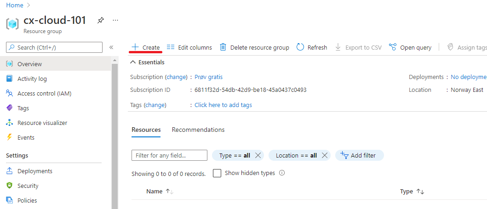
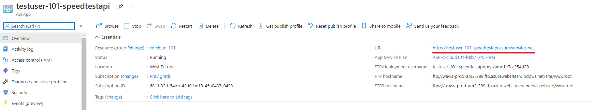
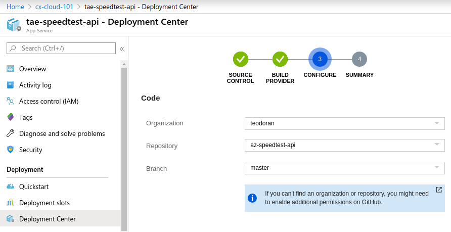

[Home](../) > [Azure](index) > An API for All Things
==========================================================
_How do we get our speedtests up to the cloud? We need an API!_

Create another git repository
-----------------------------
Create a new repository called "az-speedtest-api" as described in the previous section.
Clone the repo, and add a .gitignore-file containing the following:

```
# Build files
**/obj
**/bin

# Development configuration
**/appsettings.Development.json
**/Properties
```

This time we'll ignore a couple more files, since these files usually are used to store development secrets that shouldn't be committed to the repository.

Creating an API
---------------
Now we'll start on creating the API. Move into the `az-speedtest-api/`-folder, and execute the following command to create a new ASP.NET Core API named SpeedTestApi.

```shell
$> cd az-speedtest-api
$> dotnet new webapi -o SpeedTestApi
The template "ASP.NET Core Web API" was created successfully.

Processing post-creation actions...
Running 'dotnet restore' on SpeedTestApi/SpeedTestApi.csproj...
  Restoring packages for /home/teodoran/cloud-101/testuser/az-speedtest-api/SpeedTestApi/SpeedTestApi.csproj...
  Generating MSBuild file /home/teodoran/cloud-101/testuser/az-speedtest-api/SpeedTestApi/obj/SpeedTestApi.csproj.nuget.g.props.
  Generating MSBuild file /home/teodoran/cloud-101/testuser/az-speedtest-api/SpeedTestApi/obj/SpeedTestApi.csproj.nuget.g.targets.
  Restore completed in 18.69 sec for /home/teodoran/cloud-101/testuser/az-speedtest-api/SpeedTestApi/SpeedTestApi.csproj.

Restore succeeded.
```

Try out your new API by moving into the `SpeedTestApi/`-folder and executing `dotnet run`.

```shell
$> cd SpeedTestApi
$> dotnet run
Using launch settings from /home/teodoran/cloud-101/testuser/az-speedtest-api/SpeedTestApi/Properties/launchSettings.json...
info: Microsoft.AspNetCore.DataProtection.KeyManagement.XmlKeyManager[0]
      User profile is available. Using '/home/teodoran/.aspnet/DataProtection-Keys' as key repository; keys will not be encrypted at rest.
Hosting environment: Development
Content root path: /home/teodoran/cloud-101/testuser/az-speedtest-api/SpeedTestApi
Now listening on: https://localhost:5001
Now listening on: http://localhost:5000
Application started. Press Ctrl+C to shut down.
```

_Notice how ASP.NET Core creates two endpoints? One for http and one for https requests? This is quite useful as it enables https-redirection and http support, but when we develop locally, its definitely easiest to just use the http endpoint._

Open [http://localhost:5000/api/values](http://localhost:5000/api/values) in your favorite browser. Notice how we got redirected to [https://localhost:5001/api/values](https://localhost:5001/api/values) and that the browser complains about an insecure connection? This is because we're forcing traffic on http to be upgraded to https if possible, but we don't have a valid certificate installed that enables our machine to make a true https connection. Here's one way we can fix this.

Locate the file `Startup.cs`. This file contains, among other things, configuration and dependency injection in an ASP.NET Core API. There you'll find the method `Configure`. It's currently executing `app.UseHttpsRedirection();` in both development and production mode, so move this line up into the section only executed when the app is not in development.

```csharp
public void Configure(IApplicationBuilder app, IHostingEnvironment env)
{
    if (env.IsDevelopment())
    {
        app.UseDeveloperExceptionPage();
    }
    else
    {
        app.UseHsts();
        app.UseHttpsRedirection();
    }

    app.UseMvc();
}
```

Stop and start SpeedTestApi with `dotnet run`, and open [http://localhost:5000/api/values](http://localhost:5000/api/values) again. This time we're not redircted to https and we don't get any warnings, but we'll still use https-redirection when running in production.

_Open question: Should you use https-redirection when developing "real" applications?_

Playing Ping Pong
-----------------
So, we got an API up and running, let's make the famous ping-route!

Start by deleting the `SpeedTestApi/wwwroot`-folder. We won't be needing that. Then we can rename `SpeedTestApi/Controllers/ValuesController.cs` to `SpeedTestApi/Controllers/SpeedTestController.cs`. Update the class name and constructor name as well, and remove all methods/routes from the class.

```csharp
using Microsoft.AspNetCore.Mvc;

namespace SpeedTestApi.Controllers
{
    [Route("[controller]")]
    [ApiController]
    public class SpeedTestController : ControllerBase
    {

    }
}
```

_Whats a route? A route is a pattern that matches one or more URL's. Typically the controller has a base-route/path that'll get prefixed to all routes handled by methods in that controller. Then every route-handling method in that controller handles a sub-route/path._

First we'll change the base route for this controller from `[Route("api/[controller]")]` to `[Route("[controller]")]`. This means that all routes in this controller will start with `speedtest/...`, since this is the name of the controller.

Then we'll add a single route "ping"


```csharp
using Microsoft.AspNetCore.Mvc;

namespace SpeedTestApi.Controllers
{
    [Route("[controller]")]
    [ApiController]
    public class SpeedTestController : ControllerBase
    {
        // GET speedtest/ping
        [Route("ping")]
        [HttpGet]
        public ActionResult<string> Ping()
        {
            return Ok("PONG");
        }
    }
}
```

_Note how we're returning an `ActionResult<string>` by using `Ok("PONG")`? The response to an http-request is usually not just a string, usually you e.g. get a status code like "200 OK". By using `Ok("PONG")`, we'll make sure that we're returning a "200 OK" response, containing the string "PONG", and not just PONG._

Now we can test our ping-route. Restart SpeedTestApi, and open [http://localhost:5000/speedtest/ping](http://localhost:5000/speedtest/ping). It should display PONG.


Getting it on GitHub
--------------------
As we did for SpeedTestLogger, commit everything, and push it to GitHub.

```shell
$> git status -u
On branch master
Your branch is up-to-date with 'origin/master'.
Untracked files:
  (use "git add <file>..." to include in what will be committed)

	../.gitignore
	Controllers/SpeedTestController.cs
	Program.cs
	SpeedTestApi.csproj
	Startup.cs
	appsettings.json

nothing added to commit but untracked files present (use "git add" to track)
$> git add --all
$> git commit -m "Added /speedtest/ping"
[master c432a72] Added /speedtest/ping
 6 files changed, 119 insertions(+)
 create mode 100644 .gitignore
 create mode 100644 SpeedTestApi/Controllers/SpeedTestController.cs
 create mode 100644 SpeedTestApi/Program.cs
 create mode 100644 SpeedTestApi/SpeedTestApi.csproj
 create mode 100644 SpeedTestApi/Startup.cs
 create mode 100644 SpeedTestApi/appsettings.json
✔ ~/cloud-101/testuser/az-speedtest-api/SpeedTestApi [master ↑·1|✔] 
$> git push origin master
Username for 'https://github.com': cloud-101-testuser
Password for 'https://cloud-101-testuser@github.com': 
Counting objects: 10, done.
Delta compression using up to 8 threads.
Compressing objects: 100% (10/10), done.
Writing objects: 100% (10/10), 1.99 KiB | 0 bytes/s, done.
Total 10 (delta 0), reused 0 (delta 0)
To https://github.com/cloud-101-testuser/az-speedtest-api.git
   81e6b02..c432a72  master -> master
```

Getting it on Azure
-------------------
Finally we're getting some Azure action! We're deploying SpeedTestApi to the cloud!

### Creating an Resource Group
Everything on Azure is organized under a resource group. A resource group is a collection of resources, and everything you make on Azure is a resource. Basically it's a way to organize the stuff you make on Azure into more manageable pieces.

A resource group is connected to a subscription, and that's where the money's coming from. It's also where most of the access-control to editing stuff on Azure is done.

A quick example to make this all more concrete. Let's say you're a large organization with two consultancy firms developing Azure applications. You want the two firms to do as they please, but you want to keep track of each firms spending separately. Then you'll create two subscriptions, one for each firm. Within one firm, they might be several teams developing several applications, some that other teams shouldn't be able to edit or view, then they'll create different resource groups with different access restrictions.

We fortunately only need one resource group. Let's create it now.

Log on to [portal.azure.com](https://portal.azure.com), and navigate to "Resource groups".


Press "Add" to create a new resource group. Name it "cx-cloud-101", and set the resource group location to "West Europe".

_This is actually currently closer than North Europe, since West Europe is located in Amsterdam and North Europe in Ireland_


When the resource group is deployed, go to the resource groups page and open it by clicking on it.


### Deploying SpeedTestApi

Now we're all set to deploy our API. We'll deploy it as an API App. An API App is a managed hosting environment for API's. It understands how ASP.NET Core applications work (among others), so it's quick and easy to set it up without too much low-level configuration. At the same time it has features for scaling, easy deploy and so on. API App is an example of a PaaS-component (Platform as a Service).

Navigate to the new resource group and press "Add".



Search for "API App" and select API App from the list of results. Then press "Create".


Give the new API App a nice name. This have to be unique across azure, since it determines the URL of your API. username-speedtest-api is one way to name it.

Also select the existing resource group "cx-cloud-101", and create a new App Service plan named "cloud-101-appservice" located in "West Europe".

Then press "Ok" and "Create" and wait a bit while the new API App is being set up.


Navigate to the resource group, and open "testuser-speedtest-api".



Make a note of your URL, displayed towards the top right corner. This will be the base path of your new API on Azure.


Go to "Deployment option", and select GitHub. Authenticate, and select the az-speedtest-api project and master-branch as your deployment source. Then press "Ok".



Wait for a little bit, and then visit [https://testuser-speedtest-api.azurewebsites.net/speedtest/ping](https://testuser-speedtest-api.azurewebsites.net/speedtest/ping) (Replace https://testuser-speedtest-api.azurewebsites.net with tha URL from your APP Service/API App)


Wohoo! Congratulations, you just deployed an API on Azure!

Now what?
---------
We haven't received any speedtests from the logger, and we've just scratched the surface of Azure. In [the next part](receiving-speeds) we'll connect the logger and the api, and maybe start to do something interesting with all the data we're collecting.
