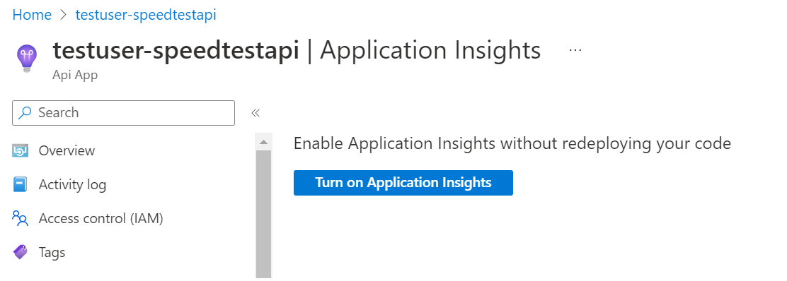

[Home](../) > [Azure](index) > Adding in Application Insights
=============================================================
_Console.WriteLine isn't so hot for real logging. When shit hits the fan, the last thing you want to do is go error hunting in a large number of terminals and error logs. In this section we'll se how we can use Application Insights to monitor the SpeedTestApi._

Adding Insights
---------------
Start by adding the package `Microsoft.ApplicationInsights.AspNetCore` to SpeedTestApi.

```shell
$ az-speedtest-api/SpeedTestApi> dotnet add package Microsoft.ApplicationInsights.AspNetCore --version 2.21.0
```

Then you need to add Application Insights in Program.cs, by adding it to the service collection.

```csharp
// Code omitted
services.AddApplicationInsightsTelemetry();
services.AddControllers();

// Code omitted
}
```

Check that SpeedTestLoger still builds, commit the changes and push to GitHub. While the new version of SpeedTestApi is deploying, we'll navigate to SpeedTestApi in the Azure portal. Open Application Insights and choose "Turn on Application Insights".



Create a new resource named speedtest-insights (we might want to use it for more speedtest-related logging than just SpeedTestApi). Choose A<span>SP.N</span>ET Core under the section "Instrument your application".


Wait until the Application Insights setup is done, and then make some requests to SpeedTestApi by running SpeedTestLogger a couple of times, so we get some request-data to analyze.

A quick look at dependencies, performance and transactions
----------------------------------------------------------
Open speedtest-insights and navigate to Application map. This shows the dependency graph for SpeedTestApi. Click on the circle representing the SpeedTestApi, and select "Investigate performance".


This will open up the Performance-view. Choose "Take action", and select one of the requests on the far right.


Now you'll get information about the transaction details for that specific request, and you'll get a breakdown of how time was spent during that transaction.


Onwards and upwards!
--------------------
Application Insights can do a lot more than wat we just covered. Play around with it and see it you can discover more interesting metrics or dashboards. Did you know that Application Insights also can monitor [local console applications](https://docs.microsoft.com/en-us/azure/application-insights/application-insights-console?toc=/azure/azure-monitor/toc.json)? You could also configure a local instance of SpeedTestApi to connect to Application Insights. In addition, you could swap out `ILogger` with a logger that sends custom log messages to Application Insights.
