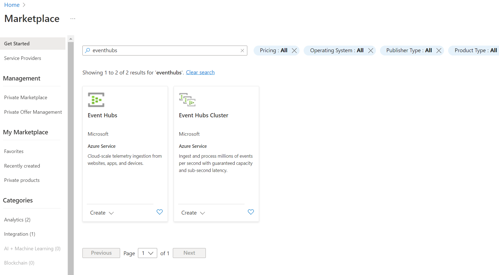
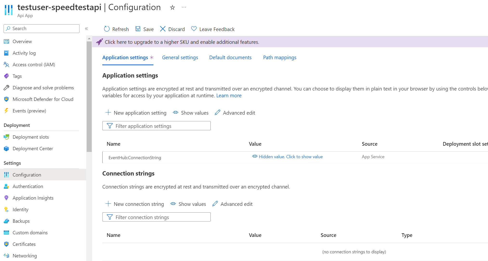
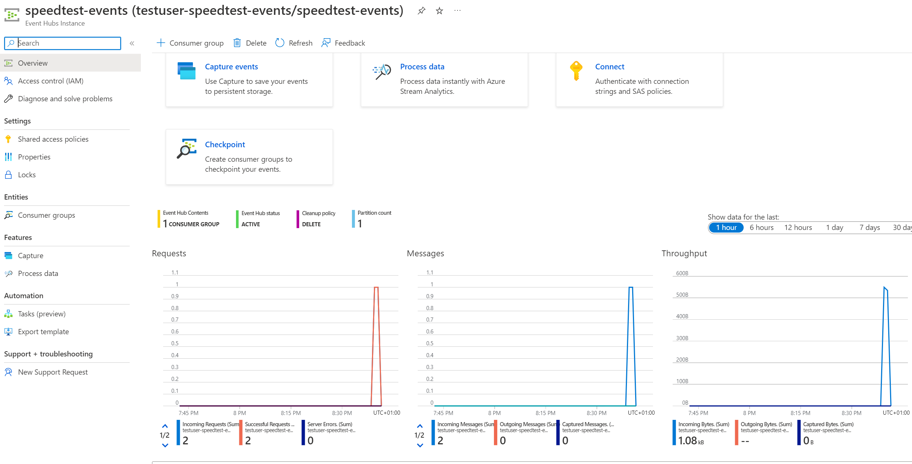

[Home](index) > Events! Events! Events!
=======================================
_We've managed to POST TestResults to Azure, but what should we do with them? In this section we'll publish them to Azure Event Hub._

### Why not just dump the TestResults in a Database?
Although this might be a more suitable solution for a simple speedtest application, using a data streaming component like Event Hub enables several applications read the data received by SpeedTestApi, without having to share a database, or be dependent on routes in SpeedTestApi. Simply put, we make the TestResults available to many different applications, without a lot of dependencies on what SpeedTestApi looks like.

It's also a good excuse to try out Event Hub.

Creating an Event Hub
---------------------
Log on to [portal.azure.com](https://portal.azure.com), navigate to the cx-cloud-101 resource group, and add a new "Event Hubs" resource.



The name of the event hub has to be unique across Azure, so name it username-speedtest-events. Going forward we'll just refer to this as testuser-speedtest-events, since our example user has the username testuser.

Use standard pricing tier, the existing resource group, and make sure it's located in "West Europe".


When the event hub resource is finished creating, open it and add a new event hub named speedtest-events


When speedtest-events is created, open it, and add a new shared access policy called SpeedTestApi, with "Send"-rights.


When the policy is created, open it and copy the "Connection string-primary key". This is the access key to our new event hub!


### Storing connection-string in appsettings.Development.json
Connections-strings, keys and secrets are stuff that we don't want to commit to git. To avoid this, we use appsettings.Development.json. This file is ignored from git, but will still be loaded when we run SpeedTestApi locally.

Let's open it and add a section with event-hub configuration.

```json
{
  "Logging": {
    "LogLevel": {
      "Default": "Debug",
      "System": "Information",
      "Microsoft": "Information"
    }
  },
  "EventHub": {
    "ConnectionString": "ADD YOUR CONNECTION STRING",
    "EntityPath": "speedtest-events"
  }
}
```

It's good practice to add corresponding properties with empty values in appsettings.json, to document what keys are needed to configure SpeedTestApi. Let's do that as well.

```json
{
  "Logging": {
    "LogLevel": {
      "Default": "Warning"
    }
  },
  "AllowedHosts": "*",
  "EventHub": {
    "ConnectionString": "",
    "EntityPath": "speedtest-events"
  }
}
```

Since we're not committing the connection string, we need to tell our API App running testuser-speedtest-api about it. Luckily API Apps know how appsettings work, so we can configure it from [portal.azure.com](https://portal.azure.com). Add a new setting under "Application settings". Name it "EventHub:ConnectionString".



_Why didn't we use the Connection strings section? Mainly because this tutorial doesn't want to delve into the differences between application settings and connection strings. Read more about [connection strings](https://docs.microsoft.com/en-us/dotnet/framework/data/adonet/connection-strings-and-configuration-files) if you're interested._

Publishing TestResults to Event Hub
-----------------------------------
In order to publish TestResults to the event hub, we'll create an ASP.NET Core service. Services are used for a lot of different things in ASP.NET Core applications, and ties together with the built-in system for [dependency injection](https://docs.microsoft.com/en-us/aspnet/core/fundamentals/dependency-injection?view=aspnetcore-2.1).

Before we start, we need to add the package Microsoft.Azure.EventHubs to SpeedTestApi. It contains code for connecting and sending messages to event hub.

```shell
dotnet add package Microsoft.Azure.EventHubs --version 2.1.0
```

Let's start writing our service by opening SpeedTestApi, creating a folder named `Services/` containing two files `Services/ISpeedTestEvents.cs` and `Services/SpeedTestEvents.cs`.

We'll create the interface in ISpeedTestEvents first. It contains a single async function for publishing a TestResult to event hub.

```csharp
using System.Threading.Tasks;
using SpeedTestApi.Models;

namespace SpeedTestApi.Services
{
    public interface ISpeedTestEvents
    {
        Task PublishSpeedTest(TestResult SpeedTest);
    }
}
```

Now we can get started on the implementation. Open SpeedTestEvents and add a class implementing ISpeedTestEvents. Similarly as with SpeedTestApiClient, we want an instance of EventHubClient, and we want to create it in the constructor, based on the connection string and the entity path. As with HttpClient, EventHubClient is something that we need to dispose of, so we'll implement the IDisposable interface as well.

_What's the entityPath? The entityPath tells event hub what event hub in the event hub namespace we're going to publish our message to._

```csharp
using System;
using System.Text;
using System.Threading.Tasks;
using Microsoft.Azure.EventHubs;
using Newtonsoft.Json;
using SpeedTestApi.Models;

namespace SpeedTestApi.Services
{
    public class SpeedTestEvents : ISpeedTestEvents, IDisposable
    {
        private readonly EventHubClient _client;

        public SpeedTestEvents(string connectionString, string entityPath)
        {
            var connectionStringBuilder = new EventHubsConnectionStringBuilder(connectionString)
            {
                EntityPath = entityPath
            };

            _client = EventHubClient.CreateFromConnectionString(connectionStringBuilder.ToString());
        }

        // Code continues here

        public void Dispose()
        {
            _client.CloseAsync();
        }
    }
}
```

Now we can write PublishSpeedTest. It's very similar to PublishTestResult in SpeedTestLogger, we still have to serialize the TestResult as JSON, but this time we won't worry about exceptions, as they'll be caught by ASP.NET Core.

```csharp
// Omitting old code
public async Task PublishSpeedTest(TestResult speedTest)
{
    var message = JsonConvert.SerializeObject(speedTest);
    var data = new EventData(Encoding.UTF8.GetBytes(message));

    await _client.SendAsync(data);
}
// Omitting old code
```

SpeedTestEvents needs to be injected as part of the dependency injection in `Startup.cs`. Use SpeedTestApi.Services and extend ConfigureServices with code that adds a scoped instance of SpeedTestEvents.

```csharp
public void ConfigureServices(IServiceCollection services)
{
    services.AddMvc().SetCompatibilityVersion(CompatibilityVersion.Version_2_1);

    var connectionString = Configuration.GetValue<string>("EventHub:ConnectionString");
    var entityPath = Configuration.GetValue<string>("EventHub:EntityPath");
    services.AddScoped<ISpeedTestEvents, SpeedTestEvents>(cts =>
    {
        return new SpeedTestEvents(connectionString, entityPath);
    });
}
```

_Services can be added with different lifetimes. A scoped service, will for instance be instantiated, and live trough a singe http request._

Finally we need to use SpeedTestEvents in SpeedTestController. Use SpeedTestApi.Services, add a property with an instance of ISpeedTestEvents and extend the controller with a constructor injecting a ISpeedTestEvents instance.

```csharp
private readonly ISpeedTestEvents _eventHub;
        
public SpeedTestController(ISpeedTestEvents eventHub)
{
    _eventHub = eventHub;
}
```

Now we can use _eventHub in UploadSpeedTest. To do that, UploadSpeedTest needs to be an async function and we have to use System.Threading.Tasks.

```csharp
public async Task<ActionResult<string>> UploadSpeedTest([FromBody] TestResult speedTest)
{
    await _eventHub.PublishSpeedTest(speedTest);
    
    var speedTestData = $"Got a TestResult from { speedTest.User } with download { speedTest.Data.Speeds.Download } Mbps.";

    return Ok(speedTestData);
}
```

Testing it all out
------------------
Try everything out locally first. Configure SpeedTestLogger to call your local instance of SpeedTestApi (`"speedTestApiUrl": "http://localhost:5000"` in appsettings.json). Run SpeedTestApi and then SpeedTestLogger. If everything worked, you should have a single successful request showing on the speedtest-events overview page.



Commit all code, and push a new version of SpeedTestApi to master, deploying the new version to Azure. Configure SpeedTestLogger to call the Azure instance of SpeedTestApi, and check that everything is alright on Azure as well.

What can we do with the events?
-------------------------------
Publishing TestResult-events to event hub, opens up a lot of possibilities when it comes to consuming the events in different applications. [Next we'll look at Time Series Insights](adding-analytics), and how we can visualize speedtests over time.