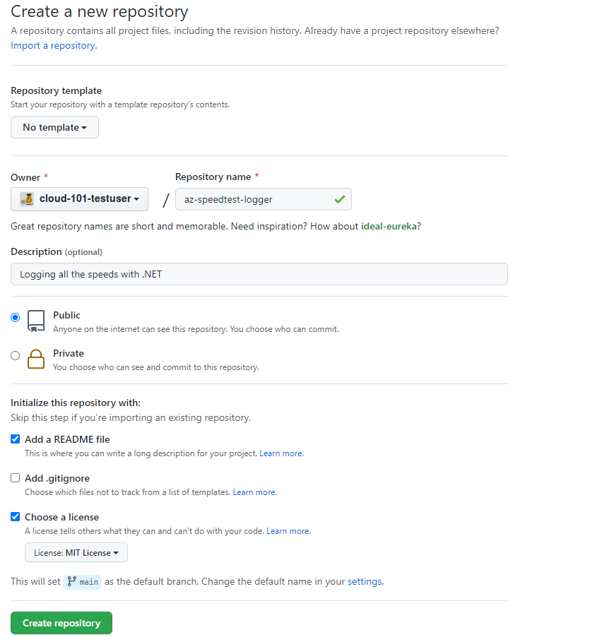

[Home](../) > [Azure](index) > Measuring Speed
====================================================
_At the heart of any decent distributed internet speed logging system, there's a program measuring internet speed. Let's start by making the SpeedTestLogger!_

Create git repo
---------------
All code should live somewhere, so let's [create a repo on GitHub](https://help.github.com/articles/create-a-repo/).

Start by navigating to your GitHub-page and select repositories.


Click "New", and create a new repository named "az-speedtest-logger". Add a description and select a licence if you're feeling fancy.



When the repository is created, press the "Clone or download"-button, and copy the url to your new repository.


Finally load up your favorite terminal, [navigate](https://www.digitalcitizen.life/command-prompt-how-use-basic-commands/) to an appropriate folder, and clone the repo with `git clone`. Remember to replace the url with the url from your repo.

```shell
$> git clone https://github.com/<your github name>/az-speedtest-logger.git
Cloning into 'az-speedtest-logger'...
remote: Enumerating objects: 4, done.
remote: Counting objects: 100% (4/4), done.
remote: Compressing objects: 100% (4/4), done.
remote: Total 4 (delta 0), reused 0 (delta 0), pack-reused 0
Unpacking objects: 100% (4/4), done.
```

At this point you should have an almost empty repo named az-speedtest-logger on your computer.

Creating a Console app
-----------------------
Now we'll start on creating the logger application. Move into the `az-speedtest-logger/`-folder, and execute the following command to create a new .NET Core console application named SpeedTestLogger.

```shell
$> cd az-speedtest-logger
$ az-speedtest-logger> dotnet new console -o SpeedTestLogger
Getting ready...
The template "Console Application" was created successfully.

Processing post-creation actions...
Running 'dotnet restore' on SpeedTestLogger\SpeedTestLogger.csproj...
  Determining projects to restore...
  Restored C:\az-speedtest-logger\SpeedTestLogger\SpeedTestLogger.csproj (in 121 ms).
Restore succeeded.
```

Try out your new console application by moving into the `SpeedTestLogger/`-folder and executing `dotnet run`.

```shell
$ az-speedtest-logger> cd SpeedTestLogger
$ az-speedtest-logger/SpeedTestLogger> dotnet run
Hello World!
```

Nothing interesting going on here, so let's continue by actually measuring internet speed.

Measuring internet speed with Speedtest.net
-------------------------------------------
[Speedtest.net](http://www.speedtest.net/) is a site used by many (including major ISP's like Get) to measure internet speed from a user machine. Reliably measuring internet speed can be a tricky subject, as you need to download and upload a bunch of different files to measure the actual speed with any kind of repeatability. Luckily we can use our open source package [SpeedTest](https://www.nuget.org/packages/Cloud101.SpeedTest/), that replicates the test performed by speedtest.net, using their test-servers.

Start by adding the SpeedTest package and resolving all dependencies:

```shell
$ az-speedtest-logger/SpeedTestLogger> dotnet add package Cloud101.SpeedTest --version 1.0.1
```

Open the `az-speedtest-logger/`-folder in VS Code, or any other preferred C# editor, and find `SpeedTestLogger/SpeedTestLogger.csproj`. Note that you now have a reference to the Cloud101.SpeedTest package.

```xml
<ItemGroup>
    <PackageReference Include="Cloud101.SpeedTest" Version="1.0.1" />
</ItemGroup>
```

Just adding a package won't get us far, so we'll quickly move on to writing some code that uses Cloud101.SpeedTest.

Printing speedtests to console
------------------------------
Open `SpeedTestLogger/Program.cs`. This is where `Main()` lives in most .NET console applications.

Add `using SpeedTest;` and `using SpeedTest.Models;` to the top of the file, so .NET knows you want to use the SpeedTest.Net package. Then we have to create a new SpeedTestClient, and get the setting for the new client.

```csharp
static void Main(string[] args)
{
    Console.WriteLine("Hello SpeedTestLogger!");

    var client = new SpeedTestClient();
    var settings = client.GetSettings();

    // Code continues here
}
```

Before we can test download and upload -speed, we have to find a suitable test-server. We do this by first looking at all the test-servers in `settings.Servers`. We then select ten servers located in Norway.

When we have ten servers, we test the server latency, and sort them by latency. Finally we pick the server with the lowest latency.

```csharp
static void Main(string[] args)
{
    // Previous code here

    Console.WriteLine("Finding best test servers");

    var location = new RegionInfo("nb-NO");
    var tenLocalServers = settings.Servers
        .Where(s => s.Country.Equals(location.EnglishName))
        .Take(10);

    var serversOrdersByLatency = tenLocalServers
        .Select(s =>
        {
            s.Latency = client.TestServerLatency(s);
            return s;
        })
        .OrderBy(s => s.Latency);

    var server = serversOrdersByLatency.First();

    // Code continues here
}
```

On the way you'll probably have added using statements for System.Globalization and System.Linq.

_Tip: Depending on your editor, you can usually get suggestions on which using statements you're missing by hovering over the keywords marked with red squiggly lines._

Now that we have a suitable test-server, we can continue by testing the download and upload -speed. The number we are given by SpeedTest.Net is in bits per second, but usually we want megabits per second (Mbps), so we'll convert the speeds into that unit of measure.

```csharp
static void Main(string[] args)
{
    // Previous code here

    Console.WriteLine("Testing download speed");
    var downloadSpeed = client.TestDownloadSpeed(server, settings.Download.ThreadsPerUrl);
    Console.WriteLine("Download speed was: {0} Mbps", Math.Round(downloadSpeed / 1024, 2));

    Console.WriteLine("Testing upload speed");
    var uploadSpeed = client.TestUploadSpeed(server, settings.Upload.ThreadsPerUrl);
    Console.WriteLine("Upload speed was: {0} Mbps", Math.Round(uploadSpeed / 1024, 2));
}
```

Finally we're ready to test our SpeedTestLogger! Run it with `dotnet run`, and you should get something similar to the listing below.

```shell
$ az-speedtest-logger/SpeedTestLogger> dotnet run
Hello SpeedTestLogger!
Finding best test servers
Testing download speed
Download speed was: 272,13 Mbps
Testing upload speed
Upload speed was: 195,32 Mbps
```

Factor/Refactor
---------------
Now is a good time to refactor our logger. We're going to do a lot more than just measuring internet speed and printing it to the console, so lets create a SpeedTestRunner with the responsibility for running speedtests.

Start by creating a new file `SpeedTestLogger/SpeedTestRunner.cs`, containing our using statements, and a public class SpeedTestRunner in the namespace SpeedTestLogger.

```csharp
using System;
using System.Globalization;
using System.Linq;
using SpeedTest;

namespace SpeedTestLogger
{
    public class SpeedTestRunner
    {
        // Code continues here
    }
}
```

We'll probably need to create some private variables for the SpeedTestClient, settings, and the location of our logger, as well as initializing these variables when constructing a new SpeedTestRunner.

```csharp
// Omitting namespace
public class SpeedTestRunner
{
    private readonly SpeedTestClient _client;
    private readonly Settings _settings;
    private readonly RegionInfo _location;

    public SpeedTestRunner(RegionInfo location)
    {
        _client = new SpeedTestClient();
        _settings = _client.GetSettings();
        _location = location;
    }

    // Code continues here
}
```

Finding the best test-server was a good chunk of code, so let's make a private function for that.

```csharp
// Omitting namespace
public class SpeedTestRunner
{
    // Previous code here

    private Server FindBestTestServer()
    {
        var tenLocalServers = _settings.Servers
            .Where(s => s.Country.Equals(_location.EnglishName))
            .Take(10);

        var serversOrdersByLatency = tenLocalServers
            .Select(s =>
            {
                s.Latency = _client.TestServerLatency(s);
                return s;
            })
            .OrderBy(s => s.Latency);

        return serversOrdersByLatency.First();
    }

    // Code continues here
}
```

Let's also create some private methods for testing download and upload -speed, and converting the result to Mbps.

```csharp
// Omitting namespace
public class SpeedTestRunner
{
    // Previous code here

    private double TestDownloadSpeed(Server server)
    {
        var downloadSpeed = _client.TestDownloadSpeed(server, _settings.Download.ThreadsPerUrl);

        return ConvertSpeedToMbps(downloadSpeed);
    }

    private double TestUploadSpeed(Server server)
    {
        var uploadSpeed = _client.TestUploadSpeed(server, _settings.Upload.ThreadsPerUrl);

        return ConvertSpeedToMbps(uploadSpeed);
    }

    private double ConvertSpeedToMbps(double speed)
    {
        return Math.Round(speed / 1024, 2);
    }

    // Code continues here
}
```

Finally we can create a reasonably small public method for running speedtests. Let's add this just below the constructor, as it's good practice to place public methods at the top of a class.

```csharp
// Omitting namespace
public class SpeedTestRunner
{
    // Omitting private variables
    public SpeedTestRunner(RegionInfo location)
    {
        // Omitting constructor content
    }

    public void RunSpeedTest()
    {
        Console.WriteLine("Finding best test servers");
        var server = FindBestTestServer();

        Console.WriteLine("Testing download speed");
        var downloadSpeed = TestDownloadSpeed(server);
        Console.WriteLine("Download speed was: {0} Mbps", downloadSpeed);

        Console.WriteLine("Testing upload speed");
        var uploadSpeed = TestUploadSpeed(server);
        Console.WriteLine("Upload speed was: {0} Mbps", uploadSpeed);
    }

    // Previous code here
}
```

Now we only have to rewrite `Main()` in Program.cs to use the new SpeedTestRunner.

```csharp
// Omitting class and namespace (bonus points for removing unused using statements)
static void Main(string[] args)
{
    Console.WriteLine("Hello SpeedTestLogger!");

    var location = new RegionInfo("nb-NO");
    var runner = new SpeedTestRunner(location);
    runner.RunSpeedTest();
}
```

Let's test our refactored SpeedTestLogger. With any luck it should do pretty much the same as before.

```shell
$ az-speedtest-logger/SpeedTestLogger> dotnet run
Hello SpeedTestLogger!
Finding best test servers
Testing download speed
Download speed was: 306,06 Mbps
Testing upload speed
Upload speed was: 166,23 Mbps
```

Making stuff configurable
-------------------------
We might want to add some configuration to our logger. At the moment all we really can configure is the logger location, and that's probably only going to be useful in Lisbon, but we might need to configure more stuff in the future (hint! hint!).

Let's start by adding some .NET Core packages for handling configuration.

```shell
$ az-speedtest-logger/SpeedTestLogger> dotnet add package Microsoft.Extensions.Configuration --version 5.0.0
$ az-speedtest-logger/SpeedTestLogger> dotnet add package Microsoft.Extensions.Configuration.FileExtensions --version 5.0.0
$ az-speedtest-logger/SpeedTestLogger> dotnet add package Microsoft.Extensions.Configuration.Json --version 5.0.0
```

Then create a LoggerConfiguration class in a new file called `SpeedTestLogger/LoggerConfiguration.cs` using, among others the configuration packages.

```csharp
using System;
using System.Globalization;
using System.IO;
using Microsoft.Extensions.Configuration;

namespace SpeedTestLogger
{
    public class LoggerConfiguration
    {
        // Code continues here
    }
}
```

We probably want a RegionInfo property to store the location of our logger. Let's make it readonly, so only the constructor in LoggerConfiguration can mess with it.
Now we can create our LoggerConfiguration constructor. We'll create a new instance of ConfigurationBuilder from Microsoft.Extensions.Configuration. then we'll tell it to look for a json configuration file called "appsettings.json" in the current directory. Finally we'll tell the ConfigurationBuilder to "build" the configuration, or in other words, load the configuration values from "appsettings.json".

```csharp
// Omitting namespace
public class LoggerConfiguration
{
    public readonly RegionInfo LoggerLocation;

    public LoggerConfiguration()
    {
        var builder = new ConfigurationBuilder()
            .SetBasePath(Directory.GetCurrentDirectory())
            .AddJsonFile("appsettings.json");

        var configuration = builder.Build();

        // Code continues here
    }
}
```

An avid reader might have spotted that we're missing something essential. We don't have an "appsettings.json" file yet! Lets create it. Make a new file called `SpeedTestLogger/appsettings.json`, containing the following:

```json
{
    "loggerLocationCountryCode": "nb-NO"
}
```

To be able to load the the appsettings.json file from the console app, we need to make sure that it is copied to the output folder. To do this, add the following to your SpeedTestLogger/SpeedTestLogger.csproj file.

```xml
<ItemGroup>
    <None Update="appsettings.json">
      <CopyToOutputDirectory>Always</CopyToOutputDirectory>
    </None>
</ItemGroup>
```


Now we can use the configuration value and create a new RegionInfo for our configured loggerLocationCountryCode.

```csharp
// Omitting namespace
public class LoggerConfiguration
{
    public readonly RegionInfo LoggerLocation;

    public LoggerConfiguration()
    {
        // Previous code here

        var countryCode = configuration["loggerLocationCountryCode"];
        LoggerLocation = new RegionInfo(countryCode);

        Console.WriteLine("Logger located in {0}", LoggerLocation.EnglishName);
    }
}
```

Let's update `Main()` in Program.cs to use the new LoggerConfiguration.

```csharp
// Omitting class and namespace
static void Main(string[] args)
{
    Console.WriteLine("Hello SpeedTestLogger!");

    var config = new LoggerConfiguration();
    var runner = new SpeedTestRunner(config.LoggerLocation);
    runner.RunSpeedTest();
}
```

Let's test the SpeedTestLogger again. This time we should print the logger location.

```shell
$ az-speedtest-logger/SpeedTestLogger> dotnet run
Hello SpeedTestLogger!
Logger located in Norway
Finding best test servers
Testing download speed
Download speed was: 446,04 Mbps
Testing upload speed
Upload speed was: 190,55 Mbps
```

Big, Bigger, Biggest Data
-------------------------
Can we get more information from a our SpeedTestClient than just download and upload -speed? Yes we can!

We're going to organize this data into a class called TestResult, containing TestData, and some metadata about the speedtest. Start by creating a new folder `Models/`, containing a new file called `SpeedTestLogger/Models/TestResult.cs`. In order not to bore you with the details of writing a large model, the contents of `TestResults.cs` have been supplied for you below.

```csharp
using System;

namespace SpeedTestLogger.Models
{
    public class TestResult
    {
        public Guid SessionId { get; set; }
        public string User { get; set; }
        public int Device { get; set; }
        public long Timestamp { get; set; }
        public TestData Data { get; set; }
    }

    public class TestData
    {
        public TestSpeeds Speeds { get; set; }
        public TestClient Client { get; set; }
        public TestServer Server { get; set; }
    }

    public class TestSpeeds
    {
        public double Download { get; set; }
        public double Upload { get; set; }
    }

    public class TestClient
    {
        public string Ip { get; set; }
        public double Latitude { get; set; }
        public double Longitude { get; set; }
        public string Isp { get; set; }
        public string Country { get; set; }
    }

    public class TestServer
    {
        public string Host { get; set; }
        public double Latitude { get; set; }
        public double Longitude { get; set; }
        public string Country { get; set; }
        public double Distance { get; set; }
        public int Ping { get; set; }
        public int Id { get; set; }
    }
}
```

_Notice how the classes are located in the namespace `SpeedTestLogger.Models`, matching the folder structure we just created?_

### Filling TestResult and TestData with data
The main idea is that our SpeedTestRunner will create the TestData object, and return it when we run a speedtest. Then `Main()` will be responsible for populating the metadata in TestResult and adding in the TestData created by SpeedTestRunner.

Let's start by rewriting `RunSpeedTest()` in SpeedTestRunner. Add a using statement at the top of `SpeedTestRunner.cs` to declare that we're going to use the models from `TestResult.cs`: `using SpeedTestLogger.Models;`, then update `RunSpeedTest()` with the following:

```csharp
// Note how this says TestData and not void
public TestData RunSpeedTest()
{
    // Old code omitted

    return new TestData
    {
        Speeds = new TestSpeeds
        {
            Download = downloadSpeed,
            Upload = uploadSpeed
        },
        Client = new TestClient
        {
            Ip = _settings.Client.Ip,
            Latitude = _settings.Client.Latitude,
            Longitude = _settings.Client.Longitude,
            Isp = _settings.Client.Isp,
            Country = _location.TwoLetterISORegionName
        },
        Server = new TestServer
        {
            Host = server.Host,
            Latitude = server.Latitude,
            Longitude = server.Longitude,
            // What are we going to do with this? Country = GetISORegionNameFromEnglishName(server.Country),
            Distance = server.Distance,
            Ping = server.Latency,
            Id = server.Id
        }
    };
}
```

So what are we going to do with `TestServer.Country`? This turns out to be more tricky than anticipated, but through the magic of previous programming, you'll just have to add the following private method to SpeedTestRunner, and un-comment the line about country in the constructor.

```csharp
private string GetISORegionNameFromEnglishName(string englishName)
{
    // Wondering why this culture isn't supported? https://stackoverflow.com/a/41879861/840453
    var unsupportedCultureLCID = 4096;

    var allRegions = CultureInfo
        .GetCultures(CultureTypes.SpecificCultures)
        .Select(culture => culture.LCID)
        .Where(lcid => lcid != unsupportedCultureLCID)
        .Select(lcid => new RegionInfo(lcid));

    var region = allRegions.FirstOrDefault(c =>
    {
        return String.Equals(c.EnglishName, englishName, StringComparison.OrdinalIgnoreCase);
    });

    if (region == null)
    {
        var unknownISORegionName = "XX";
        return unknownISORegionName;
    }

    return region.TwoLetterISORegionName;
}
```

### Adding metadata in Main()
Now we have to update `Main()` again. Add a using-statement to get the classes in `SpeedTestLogger.Models`, and create a new TestResult with the metadata and the TestData from `RunSpeedTest()`.

```csharp
// Omitting class and namespace
static void Main(string[] args)
{
    // Omitting old code

    var testData = runner.RunSpeedTest();
    var results = new TestResult
    {
        SessionId = Guid.NewGuid(),
        User = "cloud-101-testuser",
        Device = 1,
        Timestamp = DateTimeOffset.Now.ToUnixTimeMilliseconds(),
        Data = testData
    };
}
```

What!? Hard-coded values for User and Device? This sounds like a case for LoggerConfiguration!

Create two new properties in appsettings.json called `userId` and `loggerId`.

```json
{
    "userId": "cloud-101-testuser",
    "loggerId": 1,
    "loggerLocationCountryCode": "nb-NO"
}
```

Then add two new properties to LoggerConfiguration, and update the constructor to read the values from appsettings.json

```csharp
// Omitting class and namespace
public class LoggerConfiguration
{
    public readonly string UserId;
    public readonly int LoggerId;
    public readonly RegionInfo LoggerLocation;

    public LoggerConfiguration()
    {
        // Omitting old code

        UserId = configuration["userId"];
        LoggerId = int.Parse(configuration["loggerId"]);
    }
}
```

Finally we can update `Main()` to use the values from LoggerConfiguration

```csharp
// Omitting class and namespace
static void Main(string[] args)
{
   Console.WriteLine("Hello SpeedTestLogger!");

   var config = new LoggerConfiguration();
   var runner = new SpeedTestRunner(config.LoggerLocation);
   var testData = runner.RunSpeedTest();
   var results = new TestResult
   {
       SessionId = Guid.NewGuid(),
       User = config.UserId,
       Device = config.LoggerId,
       Timestamp = DateTimeOffset.Now.ToUnixTimeMilliseconds(),
       Data = testData
   };
}
```

Try out SpeedTestLogger again with `dotnet run` and check that everything works as expected.

Wrapping up
-----------
If you're happy with the SpeedTestLogger, create a file at the root of the repository (directly under `az-speedtest-logger`) called `.gitignore`. Add to it the following:

```
# Ignore build output files
**/bin
**/obj
```

This makes sure that git won't track the build output-files. If your using visual studio you might also want to ignore other temporary files generated by visual studio add-ons. Maybe copy [this](https://github.com/github/gitignore/blob/master/VisualStudio.gitignore) to your gitignore. Run `git status -u` at the root of the repository to check that `.gitignore` was set up correctly.

```shell
$ az-speedtest-logger> git status -u
On branch master
Your branch is up-to-date with 'origin/master'.
Untracked files:
  (use "git add <file>..." to include in what will be committed)

	.gitignore
	SpeedTestLogger/LoggerConfiguration.cs
	SpeedTestLogger/Models/TestResult.cs
	SpeedTestLogger/Program.cs
	SpeedTestLogger/SpeedTestLogger.csproj
	SpeedTestLogger/SpeedTestRunner.cs
	SpeedTestLogger/appsettings.json

nothing added to commit but untracked files present (use "git add" to track)
```

Then add all files to git with `git add --all`, commit the code with `git commit -m "My first SpeedTestLogger!"` and push it to GitHub using `git push origin master`:

```shell
$ az-speedtest-logger> git add --all
$ az-speedtest-logger> git commit -m "My first SpeedTestLogger!"
[master 0cfa1f3] My first SpeedTestLogger!
 7 files changed, 250 insertions(+)
 create mode 100644 .gitignore
 create mode 100644 SpeedTestLogger/LoggerConfiguration.cs
 create mode 100644 SpeedTestLogger/Models/TestResult.cs
 create mode 100644 SpeedTestLogger/Program.cs
 create mode 100644 SpeedTestLogger/SpeedTestLogger.csproj
 create mode 100644 SpeedTestLogger/SpeedTestRunner.cs
 create mode 100644 SpeedTestLogger/appsettings.json
$ az-speedtest-logger> git push origin master
Username for 'https://github.com': cloud-101-testuser
Password for 'https://cloud-101-testuser@github.com':
Counting objects: 11, done.
Delta compression using up to 8 threads.
Compressing objects: 100% (9/9), done.
Writing objects: 100% (11/11), 3.02 KiB | 0 bytes/s, done.
Total 11 (delta 0), reused 0 (delta 0)
To https://github.com/cloud-101-testuser/az-speedtest-logger.git
   8b27e75..0cfa1f3  master -> master
```

What now?
---------
This section probably left more questions that it answered. Whats the stuff with all the TestResult? Why spend so much time on configuration? Why haven't we done anything Azure-related yet? Fear not! All this, and more will be explained in the [next sections](an-api-for-all-things).
