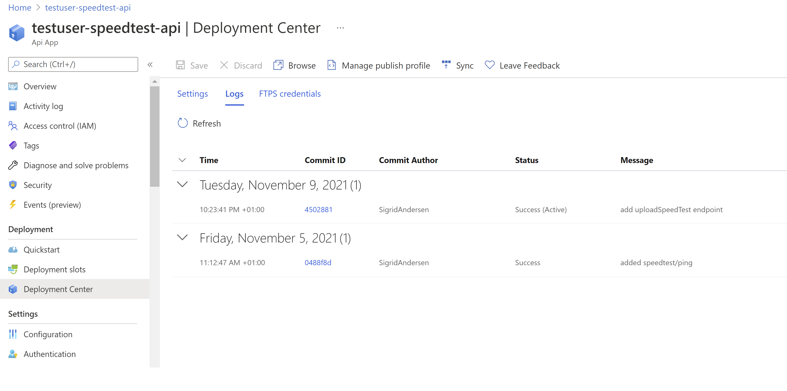

[Home](../) > [Azure](index) > Receiving speeds
=====================================================
_Previously we have made a console application capable of running speedtests, and an API that's deployed to Azure. Now er want to connect the two together._

A class for storing speedtests
------------------------------
We probably want a class describing the kind of data we expect to get from the logger. Let's start by creating a `SpeedTestApi/Models/`-folder, and copying `TestResult.cs` from `SpeedTestLogger/Models/TestResult.cs`.

Update the namespace from `SpeedTestLogger.Models` to `SpeedTestApi.Models`, so we're consistent with the folder location and the other namespaces in SpeedTestApi.

### A route for storing TestResults
Open SpeedTestController, and add a using-statement declaring that we want to use classes from SpeedTestApi.Models.

```csharp
using SpeedTestApi.Models;
```

_Build `SpeedTestApi` with `dotnet build` and reload window or restart VS Code, if you're getting strange red squiggly lines_

Now we can create a route for receiving speedtests. Open the SpeedTestController and add a new route for POSTing TestResults. Grab some data from the TestResult, and send it back, so we can see what the API received.

```csharp
// POST speedtest/
[HttpPost]
public string UploadSpeedTest([FromBody] TestResult speedTest)
{
    return $"Got a TestResult from { speedTest.User } with download { speedTest.Data.Speeds.Download } Mbps.";
}
```

_Note how we're using the `[FromBody]` annotation in the route method? This will cause ASP.NET Core to automatically parse the JSON-object sent to speedtest/ into a TestResult._

Let's test our new route. Run SpeedTestApi with `dotnet run`, boot up [Postman](https://www.getpostman.com/), or your favorite API-testing tool, and try to POST a new TestResult to SpeedTestApi.


```json
{
	"user": "cloud-101-testuser",
	"data": {
		"speeds": {
			"download": 13.37
		}
	}
}
```

We can get away with just posting parts of a TestResult. This is because we're not validating the contents of the TestResult we're receiving. This is usually a bad thing when creating APIs. Luckily we can solve this by using [DataAnnotations](https://docs.microsoft.com/en-us/aspnet/core/tutorials/first-mvc-app/validation?view=aspnetcore-5.0).


Adding DataAnnotations to TestResult and friends
------------------------------------------------
When creating an API for storing stuff, it's nice to be quite strict on what kind of data is allowed into the API. In ASP.NET Core, we can create restrictions on what kind of data is allowed in a class when receiving it in a request. We do this by using `System.ComponentModel.DataAnnotations`, and annotating our properties with annotations like `[Required]` and `[Range(1, int.MaxValue)]`.

Lets add DataAnnotations to the classes in `TestResult.cs`.

```csharp
using System;
using System.ComponentModel.DataAnnotations;

namespace SpeedTestApi.Models
{
    public class TestResult
    {
        [Required]
        public Guid SessionId { get; set; }

        [StringLength(500, MinimumLength = 2)]
        [Required]
        public string User { get; set; }

        [Range(1, int.MaxValue)]
        [Required]
        public int Device { get; set; }

        [Range(0, long.MaxValue)]
        [Required]
        public long Timestamp { get; set; }

        [Required]
        public TestData Data { get; set; }
    }

    public class TestData
    {
        [Required]
        public TestSpeeds Speeds { get; set; }

        [Required]
        public TestClient Client { get; set; }

        [Required]
        public TestServer Server { get; set; }
    }

    public class TestSpeeds
    {
        [Range(0, 3000)]
        [Required]
        public double Download { get; set; }

        [Range(0, 3000)]
        [Required]
        public double Upload { get; set; }
    }

    public class TestClient
    {
        [RegularExpression(@"^(?:(?:25[0-5]|2[0-4][0-9]|[01]?[0-9][0-9]?)\.){3}(?:25[0-5]|2[0-4][0-9]|[01]?[0-9][0-9]?)$")]
        [Required]
        public string Ip { get; set; }

        [Range(-90, 90)]
        public double Latitude { get; set; }

        [Range(-180, 180)]
        public double Longitude { get; set; }

        [StringLength(500, MinimumLength = 2)]
        [Required]
        public string Isp { get; set; }

        [RegularExpression(@"^([A-Z]){2}$")]
        [Required]
        public string Country { get; set; }
    }

    public class TestServer
    {
        [StringLength(500, MinimumLength = 2)]
        [Required]
        public string Host { get; set; }

        [Range(-90, 90)]
        [Required]
        public double Latitude { get; set; }

        [Range(-180, 180)]
        [Required]
        public double Longitude { get; set; }

        [RegularExpression(@"^([A-Z]){2}$")]
        [Required]
        public string Country { get; set; }

        [Range(0, 21000000)]
        [Required]
        public double Distance { get; set; }

        [Range(0, int.MaxValue)]
        [Required]
        public int Ping { get; set; }

        [Range(0, int.MaxValue)]
        [Required]
        public int Id { get; set; }
    }
}
```

Restrict the properties in a lot of different ways:
* Want to enforce that a property is required? Use `[Required]`.
* Want Device to only be positive integers? Use `[Range(1, int.MaxValue)]`.
* Only want to store 500 characters of User (maybe this is a limit in your database) and require it to be at least 2 characters long? Use `[StringLength(500, MinimumLength = 2)]`.
* You can even create crazy regex-expressions to enforce Ip to be a valid IP-address: `[RegularExpression(@"^(?:(?:25[0-5]|2[0-4][0-9]|[01]?[0-9][0-9]?)\.){3}(?:25[0-5]|2[0-4][0-9]|[01]?[0-9][0-9]?)$")]`.

Restart SpeedTestApi, and try to POST the TestResult again.


Notice how we get validation-errors back from SpeedTestApi? We actually have a lot more errors, but we only get back a subset, to keep things snappy. Let's try to post a real TestResult.

```json
{
    "sessionId": "5e91ac64-1010-4d31-91d1-41c84d0b69a2",
    "user": "cloud-101-testuser",
    "device": 1,
    "timestamp": 123456789,
    "data": {
        "speeds": {
            "download": 13.37,
            "upload": 4.2
        },
        "client": {
            "ip": "127.0.0.1",
            "latitude": 1.2,
            "longitude": 92.7,
            "isp": "Get",
            "country": "NO"
        },
        "server": {
            "host": "get.speedtest.net",
            "latitude": 1.3,
            "longitude": 93.0,
            "country": "NO",
            "distance": 3001,
            "ping": 12,
            "id": 42
        }
    }
}
```

Now everything should validate correctly.


Logging in ASP.NET Core
-----------------------
Before we try to send data from the logger to the API, we probably should implement some form of logging, so SpeedTestApi can inform us that it has received a TestResult. One way of doing this is just to use `Console.WriteLine(...)` like we did in the logger, but [ASP.NET Core supports a logging API](https://docs.microsoft.com/en-us/aspnet/core/fundamentals/logging/?view=aspnetcore-5.0) out of the box, so instead we'll try to be fancy this time.

### Injecting an instance of ILogger
Most things in ASP.NET Core is composed using [dependency injection](https://docs.microsoft.com/en-us/aspnet/core/fundamentals/dependency-injection?view=aspnetcore-5.0). This means, without going into details, that ASP.NET Core can supply our controller (and other classes) with instances of objects we want to use for different things. This can be home made objects, like a database service for storing and retrieving information from a database, or built in objects, like the instance of `ILogger` that we need to use the logging API.

Open SpeedTestController again, and add a using-statement declaring that we want to use the logging extensions in Microsoft.Extensions.Logging.

```csharp
using Microsoft.Extensions.Logging;
```

Then add a private variable named `_logger` and a constructor accepting an instance of `ILogger<SpeedTestController>`, that you assign to the `_logger` variable.

```csharp
// Omitting previous code

[ApiController]
[Route("[controller]")]
public class SpeedTestController : ControllerBase
{
    private readonly ILogger _logger;

    public SpeedTestController(ILogger<SpeedTestController> logger)
    {
        _logger = logger;
    }

// Omitting previous code
```

_What's the deal with `ILogger<SpeedTestController>`? ILogger is a generic interface, meaning that it can change the way it works based on the class we supply as a parameter. [Generic interfaces](https://docs.microsoft.com/en-us/dotnet/csharp/programming-guide/generics/generic-interfaces) is outside the scope of this workshop, but in essence it's a bit like `List<int>`, where we change the meaning of `List` by supplying `int` as a parameter._

Now we can update `UploadSpeedTest(...)` to use the logger to log the response.

```csharp
// Omitting previous code

// POST speedtest/
[HttpPost]
public string UploadSpeedTest([FromBody] TestResult speedTest)
{
    var response = $"Got a TestResult from { speedTest.User } with download { speedTest.Data.Speeds.Download } Mbps.";
    _logger.LogInformation(response);

    return response;
}

// Omitting previous code
```

If you try to run SpeedTestApi again, and POST a new TestResult to the API, you should see a single log-statement showing that the API received a TestResult.

```shell
$ az-speedtest-api/SpeedTestApi> dotnet run
info: Microsoft.Hosting.Lifetime[0]
      Now listening on: https://localhost:5001
info: Microsoft.Hosting.Lifetime[0]
      Now listening on: http://localhost:5000
info: Microsoft.Hosting.Lifetime[0]
      Application started. Press Ctrl+C to shut down.
info: Microsoft.Hosting.Lifetime[0]
      Hosting environment: Development
info: Microsoft.Hosting.Lifetime[0]
      Content root path: /home/teodoran/cloud-101/az-test/az-speedtest-api/SpeedTestApi
info: SpeedTestApi.Controllers.SpeedTestController[0]
      Got a TestResult from cloud-101-testuser with download 19.48 Mbps.
```

Calling SpeedTestApi from SpeedTestLogger
-----------------------------------------
We'll return to the SpeedTestLogger and try to POST TestResults to the new route in SpeedTestApi.

### Time for another config-value
In order to call SpeedTestApi we need an URL. This should probably be configurable. Open `SpeedTestLogger/appsettings.json` and add a new property for the speedTestApiUrl.

```json
{
    "userId": "cloud-101-testuser",
    "loggerId": 1,
    "loggerLocationCountryCode": "nb-NO",
    "speedTestApiUrl": "http://localhost:5000"
}
```

Then open `SpeedTestLogger/LoggerConfiguration.cs` and add a property for the URL.

```csharp
public readonly Uri ApiUrl;
```

Finally we can read speedTestApiUrl and assign it to ApiUrl in the constructor.

```csharp
ApiUrl = new Uri(configuration["speedTestApiUrl"]);
```

### A client for POSTing TestResults
Now we can start writing the code responsible for POSTing TestResults to SpeedTestApi. Create a new file and class called SpeedTestApi in SpeedTestLogger. We want it to contain an instance of System.Net.Http.HttpClient (a built-in class for performing http-requests), and we want that instance to be configures with the speedTestApiUrl. An instance of HttpClient holds on to some system resources, so we want to make sure that we dispose, or "clean up", that instance when we're done with it. The usual way of doing this is to implement the IDisposable interface, signalling that instances of SpeedTestApiClient should be disposed, and handling clean-up of the HttpClient instance there.

```csharp
using System;
using System.Net.Http;
using System.Text;
using System.Text.Json;
using System.Threading.Tasks;
using SpeedTestLogger.Models;

namespace SpeedTestLogger
{
    public sealed class SpeedTestApiClient : IDisposable
    {
        private readonly HttpClient _client;

        public SpeedTestApiClient(Uri speedTestApiUrl)
        {
            _client = new HttpClient
            {
                BaseAddress = speedTestApiUrl
            };
        }

        // Code continues here

        public void Dispose()
        {
            _client.Dispose();
        }
    }
}
```

With an instance of HttpClient in place, we can write the code that POST a TestResult to SpeedTestApi.

```csharp
// Omitting previous code
public async Task<bool> PublishTestResult(TestResult result)
{
    var json = JsonSerializer.Serialize(result);
    var content = new StringContent(json, Encoding.UTF8, "application/json");

    return await PostTestResult(content);
}

private async Task<bool> PostTestResult(StringContent result)
{
    try
    {
        var response = await _client.PostAsync("/speedtest", result);
        if (!response.IsSuccessStatusCode)
        {
            var content = await response.Content.ReadAsStringAsync();
            Console.WriteLine("Upload failed! Failure response: {0}", content);

            return false;
        }

        return true;
    }
    catch (HttpRequestException e)
    {
        Console.WriteLine("Upload failed! {0}", e.Message);

        return false;
    }
}
// Omitting previous code
```

A POST-request can't send objects, so we need to serialize our TestResult as JSON with `JsonSerializer.Serialize(result)`. We also add some request headers to the POST-request, declaring that we're sending JSON-data, encoded in UTF8.

`_client.PostAsync("/speedtest", result);` can fail, so we do some basic error-handling if that occurs.

### Updating Main() to use SpeedTestApiClient
Open `Program.cs` and extend `Main()` with code sending the TestResult to SpeedTestApi.

```csharp
using System;
using System.Globalization;
using System.Threading.Tasks;
using SpeedTestLogger.Models;

namespace SpeedTestLogger
{
    class Program
    {
        static async Task Main(string[] args)
        {
            // Omitting old code
            var success = false;
            using (var client = new SpeedTestApiClient(config.ApiUrl))
            {
                success = await client.PublishTestResult(results);
            }

            if (success)
            {
                Console.WriteLine("Speedtest complete!");
            }
            else
            {
                Console.WriteLine("Speedtest failed!");
            }
        }
    }
}
```

Note how we suddenly got `static async Task Main(...)`? Since PublishTestResult is an async function, we need to wait for it to complete. Previously we had to do some tricks to evaluate async functions in a synchronous/regular function, but since C# 7.1, we can just make `Main()` an async function and use `await`.

Also note that we're using `using (var client = new SpeedTestApiClient(config.ApiUrl)) { ... }` when creating the instance of SpeedTestApiClient. Remember the stuff about SpeedTestApiClient, HttpClient and IDispose? When we're using `using (...) { ... }`, we're making sure that `Dispose()` gets called as soon as we're done with the code inside the using-block.

### Does it work?
Let's try it out by first starting SpeedTestApi and then starting SpeedTestLogger.

```shell
$ az-speedtest-api/SpeedTestApi> dotnet run
info: Microsoft.Hosting.Lifetime[0]
      Now listening on: https://localhost:5001
info: Microsoft.Hosting.Lifetime[0]
      Now listening on: http://localhost:5000
info: Microsoft.Hosting.Lifetime[0]
      Application started. Press Ctrl+C to shut down.
info: Microsoft.Hosting.Lifetime[0]
      Hosting environment: Development
info: Microsoft.Hosting.Lifetime[0]
      Content root path: /home/cloud-101/testuser/az-speedtest-api/SpeedTestApi
```

If everything went alright, you should get "Speedtest complete!".

```shell
$ az-speedtest-logger/SpeedTestLogger> dotnet run

Hello SpeedTestLogger!
Finding best test servers
Testing download speed
Download speed was: 301,71 Mbps
Testing upload speed
Upload speed was: 128,6 Mbps
Speedtest complete!
```

Looking at the log-output from SpeedTestApi, you should get a single line informing us that /speedtest was called.

```shell
$ az-speedtest-api/SpeedTestApi> dotnet run
info: Microsoft.Hosting.Lifetime[0]
      Now listening on: https://localhost:5001
info: Microsoft.Hosting.Lifetime[0]
      Now listening on: http://localhost:5000
info: Microsoft.Hosting.Lifetime[0]
      Application started. Press Ctrl+C to shut down.
info: Microsoft.Hosting.Lifetime[0]
      Hosting environment: Development
info: Microsoft.Hosting.Lifetime[0]
      Content root path: /home/teodoran/cloud-101/az-test/az-speedtest-api/SpeedTestApi
info: SpeedTestApi.Controllers.SpeedTestController[0]
      Got a TestResult from cloud-101-testuser with download 301,71 Mbps.
```

Putting it all up on Azure
--------------------------
Add and commit all changes to SpeedTestApi and then push to master. This will trigger a new deployment of testuser-speedtest-api on Azure. You can view in-progress deployments under "Deployment center".



When the deployment is a success, its time to test it all out. Try a quick POST with Postman first to check that all is well. Then update speedTestApiUrl in appsettings.json with the URL of your Azure API App.

```json
"speedTestApiUrl": "https://testuser-speedtest-api.azurewebsites.net"
```

Are you still getting "Speedtest complete!"?

If everything is alright, add, commit and push the changes to SpeedTestLogger.

What should we do with the TestResult?
--------------------------------------
Congratulations! We managed to get a TestResult from our local logger to our API on Azure, but the question remains. What to do with it?

In [the next section](events-events) we'll publish the TestResult to Azure Event Hub, possibly making it available to other applications.
