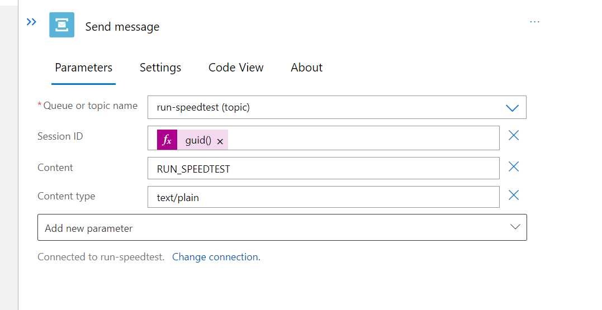

[Home](../) > [Azure](index) > Scheduling Speed Tests
=====================================================
_It's tedious to run SpeedTestLogger manually all the time. Let's fix that by making a system that schedules speedtests._

In this section we'll try to let you figure out more on your own. Some relevant documentation is linked in the text, and the basic outline of what you need to do is described below.

Creating a new Service Bus
--------------------------
The service bus will deliver run-speedtest messages to SpeedTestLogger, telling it to run a test.

1. Create a [new service bus namespace](https://docs.microsoft.com/en-us/azure/service-bus-messaging/service-bus-dotnet-how-to-use-topics-subscriptions) named speedtest-commands, with a topic called run-speedtest. Use standard pricing tier.

2. Create two new shared access policies on speedtest-command. One named SpeedTestLogger with "Listen" access, and one named SpeedTestScheduler with "Manage", "Send" and "Listen"
3. Create a new subscription on the topic called speedtest-logger-subscription. 

Scheduling speedtests
---------------------
We need something that can trigger new run-speedtest messages at a recurring schedule. A Logic App is an easy way to do this.

1. Create a new [Logic App](https://docs.microsoft.com/en-us/azure/logic-apps/quickstart-create-first-logic-app-workflow) named speedtest-scheduler. And a stateful workflow named speedtest-sceduler.
2. Open the Logic App Designer and start with a Recurrence trigger. It's nice to start with a short interval when developing. Maybe 5 min?
3. Add a new step for sending a message to the service bus topic. Use the connection string from the SpeedTestScheduler shared access policy from in the run-speedtest service bus namespace. Use dynamic content as Session Id and generate a guid with `guid()`. Use RUN_SPEEDTEST as content.

Read RUN_SPEEDTEST
------------------
Finally we need to update SpeedTestLogger to trigger a new speedtest when given a run-speedtest message from the service bus.

1. Add the package Azure.Messaging.ServiceBus to SpeedTestLogger with `dotnet add package Azure.Messaging.ServiceBus --version 7.12.0`
2. Update SpeedTestLogger to trigger speedtests when it receives a "RUN_SPEEDTEST"-message. [This section in the documentation](https://docs.microsoft.com/en-us/azure/service-bus-messaging/service-bus-dotnet-how-to-use-topics-subscriptions#5-receive-messages-from-the-subscription) describes how you can go about receiving messages from service bus. If you're stuck, have a quick look at [this example implementation](https://github.com/cx-cloud-101/az-speedtest-logger/blob/master/SpeedTestLogger/Program.cs).
3. You might want to update LoggerConfiguration to handle the service bus connection string.
