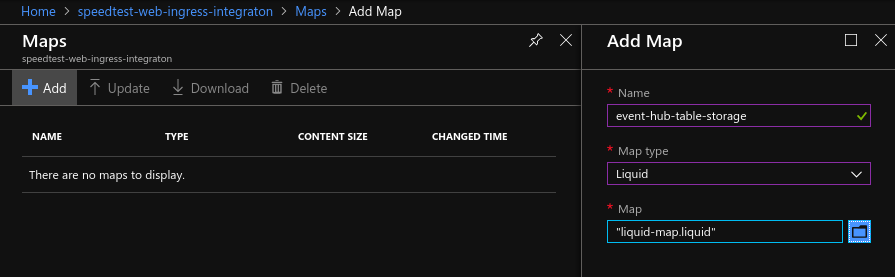

[Home](../) > [Azure](index) > The one with the Web Page
========================================================
_Usually you'll end up with a more or less user-friendly webpage as part of your solution. In this section we'll create just that, and on the way see how having two applications receiving events from the same hub works._

In this section we'll try to let you figure out more on your. Some relevant documentation is linked in the text, and the basic outline of what you need to do is described below.

SQL? NoSQL!
-----------
Our new web page will need to get speedtest data from somewhere. One solution is to store data from event hub in [azure table storage](https://docs.microsoft.com/en-us/azure/cosmos-db/table-storage-overview).

1. Create a new storage account named usernamespeedtestwebstorage.
2. When the new storage account is created, open it and create a new table under table service named SpeedTests.
3. Create two new access policies for the table. One named speedtest-web with read permissions, and one named speedtest-ingress with all permissions.

Server more, Serverless
-----------------------
Now that we have a table for storing speedtests, we need something to read events from event hub, and put a selection of data into table storage. This can be done in several ways, and we'll illustrate a solution using a [Logic App](https://docs.microsoft.com/en-us/azure/logic-apps/), but you could just as easily use [Azure Functions](https://docs.microsoft.com/en-us/azure/azure-functions/) or something similar.

1. Create a new Integration account named speedtest-web-ingress-integraton.
2. Add new map named event-hub-table-storage. Make it a liquid map, and upload a map containing the following in a file named map.liquid



```
{
   "PartitionKey": "{{ content.User }}",
   "RowKey": "{{ "now" | Date: "dd-MM-yyyy HH:mm:ss" }}",
   "Download": "{{ content.Data.Speeds.Download }}",
   "Upload": "{{ content.Data.Speeds.Upload }}"
}
```

3. Create a new Logic App named speedtest-web-ingress.
4. Create a new consumer group in the event hub named speedtest-web.
5. Start with a blank template, and create an event hub trigger, using the speedtest-web consumer group and content type "application/json". Then parse the body of the event to JSON. Note: When parsing JSON, Content should be used, not Body as illustrated below.


The schema for parsing JSON will be as follows:

```json
{
    "type": "object",
    "properties": {
        "SessionId": {
            "type": "string"
        },
        "User": {
            "type": "string"
        },
        "Device": {
            "type": "integer"
        },
        "Timestamp": {
            "type": "integer"
        },
        "Data": {
            "type": "object",
            "properties": {
                "Speeds": {
                    "type": "object",
                    "properties": {
                        "Download": {
                            "type": "number"
                        },
                        "Upload": {
                            "type": "number"
                        }
                    }
                },
                "Client": {
                    "type": "object",
                    "properties": {
                        "Ip": {
                            "type": "string"
                        },
                        "Latitude": {
                            "type": "number"
                        },
                        "Longitude": {
                            "type": "number"
                        },
                        "Isp": {
                            "type": "string"
                        },
                        "Country": {
                            "type": "string"
                        }
                    }
                },
                "Server": {
                    "type": "object",
                    "properties": {
                        "Host": {
                            "type": "string"
                        },
                        "Latitude": {
                            "type": "number"
                        },
                        "Longitude": {
                            "type": "number"
                        },
                        "Country": {
                            "type": "string"
                        },
                        "Distance": {
                            "type": "number"
                        },
                        "Ping": {
                            "type": "integer"
                        },
                        "Id": {
                            "type": "integer"
                        }
                    }
                }
            }
        }
    }
}
```
6. Transform the parsed JSON using the liquid map event-hub-table-storage. Finally insert the transformed json into the SpeedTests table.


7. If you're having trouble locating the liquid map, you might have to link the integration account to your logic app manually.


Run the SpeedTestLogger a couple of times, and check if the logic app is able to read, transform and insert data from the speedtests. If everything seems to be in order, you're ready to create an API to expose the data from table storage.

A route for viewing speeds
--------------------------
You'll need something that can serve the stored speedtests from table storage to the web-page. One option is to update SpeedTestApi with a new route for getting speedtests. GET /speedtest is probably the obvious option for what route to choose. Have a look at [this guide](https://docs.microsoft.com/en-us/azure/cosmos-db/table-storage-how-to-use-dotnet) to get a feel of how you'll read data from table storage.

Another option is to use yet another logic app with a HTTP request trigger. The option is yours.

The Web Page
------------
Now you only have to create a webpage to show off your data. This can be made with numerous different frameworks and tools, but one option is [d3js](https://d3js.org). Have a look at [this site](https://taespeedtestwebstorage.z6.web.core.windows.net/) if you want an example of one way of displaying speedtests using d3js.

Finally you'll need to decide how to host your website. The possibilities are endless, but one simple solution is to use [static website hosting in Azure Storage](https://docs.microsoft.com/en-us/azure/storage/blobs/storage-blob-static-website), from the same storage container that contains the table storage instance.
