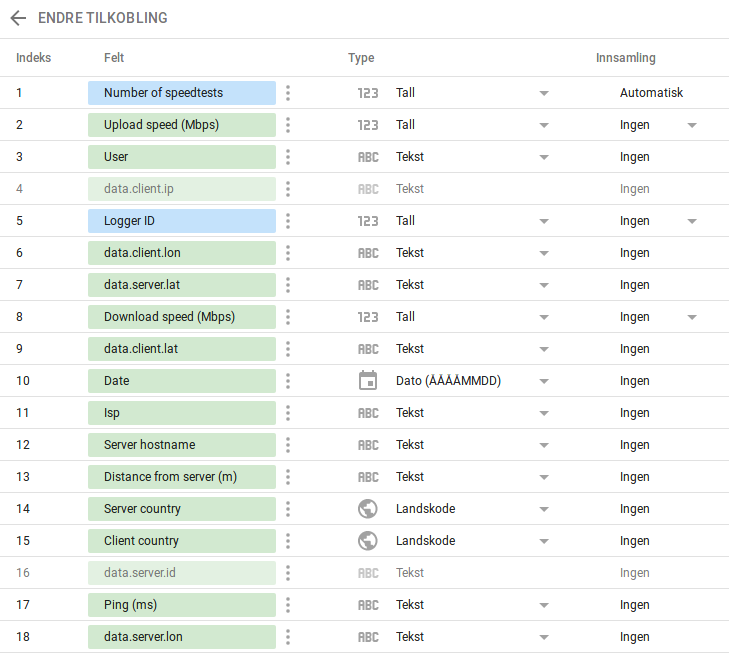

[Home](../) > [GCP](index) > Analyzing it all
===================================================
_In this section we'll create a report using [Looker Studio](https://lookerstudio.google.com/) and analyze the speedtests we stored in Big Query._

Connecting to Big Query
-----------------------
Looker Studio lets you build visualizations and reports straight in the browser. It's quite easy to use, even for non-programmers, given that you create a good data connection. That's what we'll try to do in this section.

### Getting a signal
Open [Looker Studio](https://lookerstudio.google.com/) and create an empty report. Click through the getting started prompt, if you haven't already, and open the empty report. 
Create a new data source, and you'll get an overview of all the different data sources that's supported by Looker Studio. Since we're interested in our speedtests stored in Big Query, choose Big Query.

Authorize the connection to Big Query, and find your GCP-project, the speedtest dataset and your table containing test_results. Click connect to establish a connection between your report and the Big Query table.

Looker Studio will make attempt to assign the correct data types to your fields. These suggestions can be quite good, but usually it's room for improvement.
In the Data column click the BigQuery icon next to the data source name to edit your data source.

 
It's also worth to give all properties you plan to use in your report good readable names, 
since most of the visualizations we'll create later creates labels based on the names used in the connection. 
Hiding irrelevant properties is also worth considering, if you want to maximize the ease of editing your report.
Another idea would be to convert the download and upload speed to Mbps instead of Bps, to make it more readable.
Below is a suggested update to the data connection.

You can also combine properties into new properties by combining existing properties with different functions.

You can also choose a default aggregation value. Download and upload would probably be averaged when aggregated for instance.

When you're done editing your connection, add it to the report.

Creating a Speed Test Report
----------------------------
_Now is probably a good time to name your report._

Let's start by adding a time-series graph. Try to configure it, so it shows download and upload speed by date.

We can also try out or combined latitude, longitude property in a map.

You can also add user-defined filters to the report. These will filter the data shown inn all graphs automatically.

Play around with your report and the different components available. Here's two examples of speedtest reports. [One in a light theme](https://datastudio.google.com/open/1w0zwpAn4eXDWgEvk_LXP6crbrmUnz5T5) and [one in a dark theme](https://datastudio.google.com/open/1s_3XyPq7ViHwY5vPLucxSJAmmyupJb1W).

Sharing your report
-------------------
One of the best things about Looker Studio, is how easy it's to share your reports. Just click the share-button right beside the edit-button, and you can share it just like a Google Drive document or presentation. Given the right access, people can copy, extend or remix your report, encouraging collaboration.

What now?
---------
Congratulations! You have just made a complete speedtest solution on GCP.
