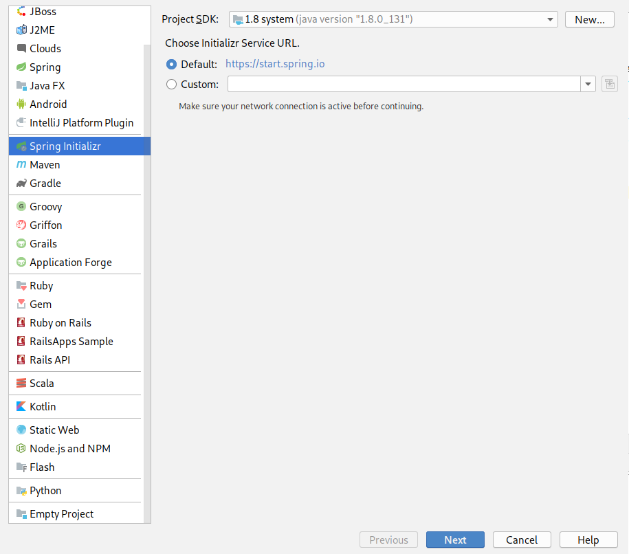
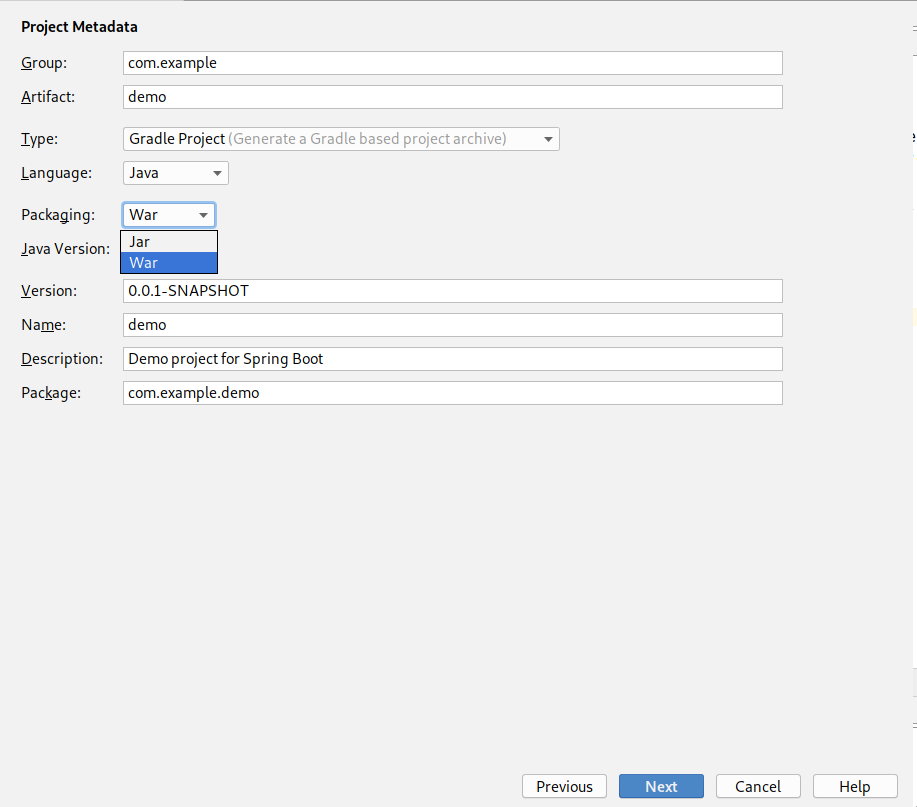
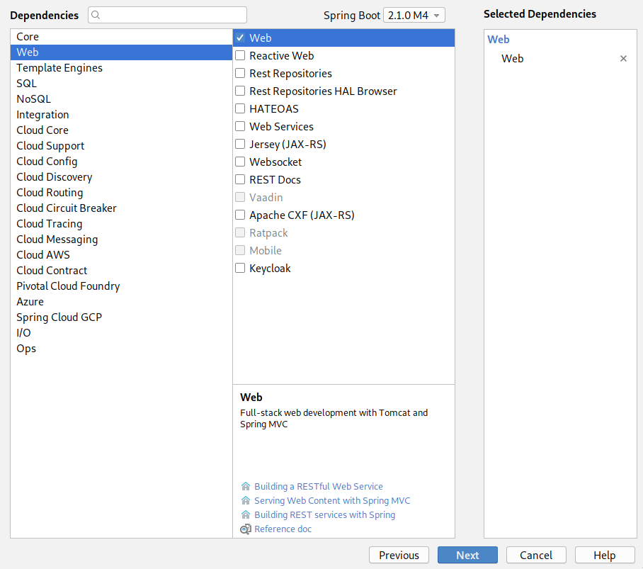
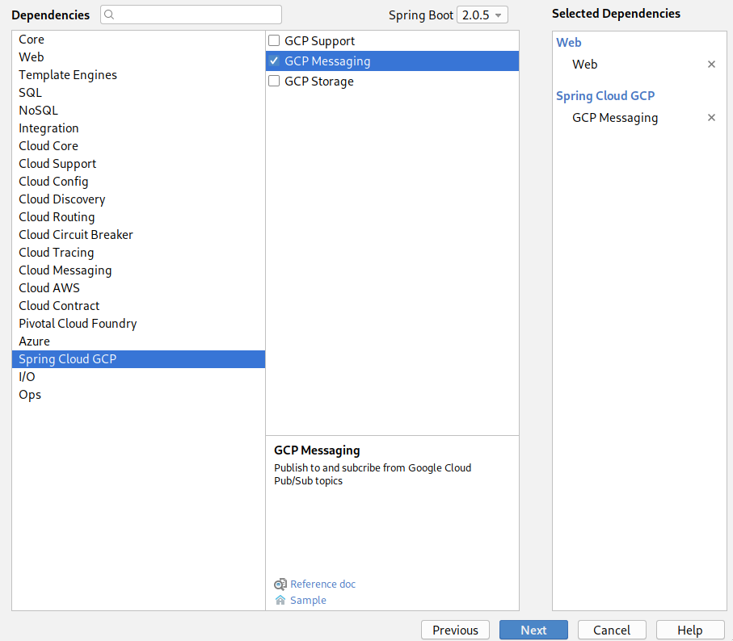
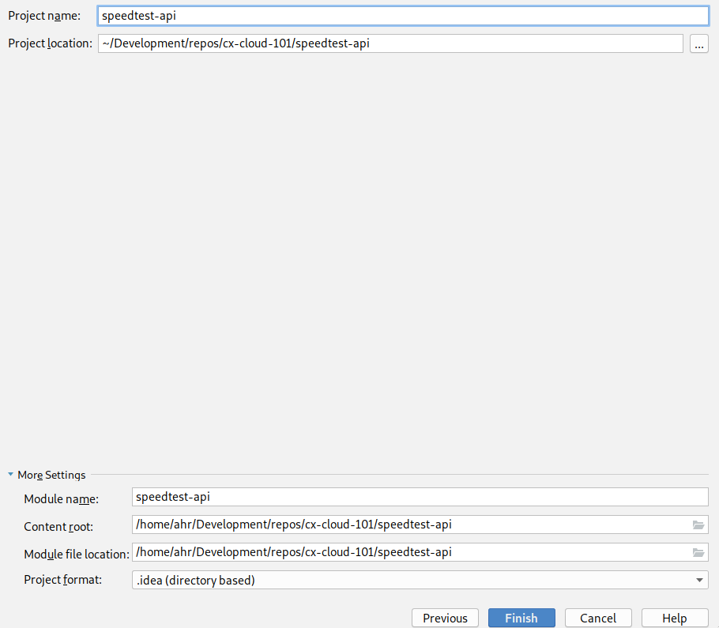
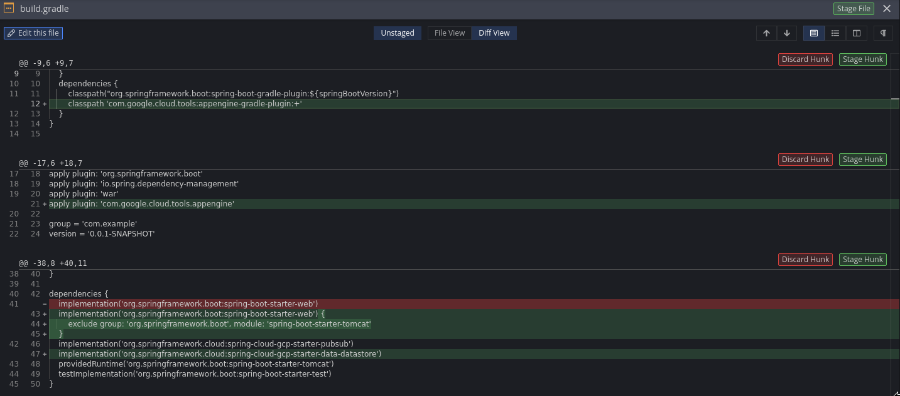

This guide assumes that you have Jetbrains IntelliJ Ultimate, if you don't have that you can use IntelliJ Community edition (or your prefered Java IDE) and [Spring Initializr](https://start.spring.io/) as replacement.

1. Create a new Project in IntelliJ
2. Select *Spring Initializr* from the sidebar and continue



3. Select `Gradle` as *Type* and `War` (**Important**) as *Packaging*. On the Spring Initializr website you must click on *Switch to the full version*.



4. Add Spring Web dependency



5. Add Spring Cloud GCP Messaging dependency



6. Click on finish. On the Spring Initializr website you will get a zip-file, extract it and open it as a project in your IDE.



7. Modify `gradle.build` so that it can be deployed as a GCP Appengine Standard Java app
   


8. Add the following files to `/src/webapp/WEB-INF`
   1. appengine-web.xml
   ```xml
    <?xml version="1.0" encoding="UTF-8"?>
    <appengine-web-app xmlns="http://appengine.google.com/ns/1.0">
        <threadsafe>true</threadsafe>
        <runtime>java8</runtime>
        <sessions-enabled>true</sessions-enabled>
        <warmup-requests-enabled>true</warmup-requests-enabled>
        <env-variables>
            <env-var name="DEFAULT_ENCODING" value="UTF-8"/>
        </env-variables>
    </appengine-web-app>
   ```
   1. web.xml
   ```xml    <?xml version="1.0" encoding="utf-8"?>
    <web-app xmlns="http://xmlns.jcp.org/xml/ns/javaee"
             xmlns:xsi="http://www.w3.org/2001/XMLSchema-instance"
             xsi:schemaLocation="http://xmlns.jcp.org/xml/ns/javaee
             http://xmlns.jcp.org/xml/ns/javaee/web-app_3_1.xsd"
             version="3.1">
    
        <servlet>
            <servlet-name>speedtest-api</servlet-name>
            <servlet-class>org.springframework.web.servlet.DispatcherServlet</servlet-class>
            <init-param>
                <param-name>contextAttribute</param-name>
                <param-value>org.springframework.web.context.WebApplicationContext.ROOT</param-value>
            </init-param>
            <load-on-startup>1</load-on-startup>
        </servlet>
    
        <servlet-mapping>
            <servlet-name>speedtest-api</servlet-name>
            <url-pattern>/*</url-pattern>
        </servlet-mapping>
    
        <welcome-file-list>
            <welcome-file>index.html</welcome-file>
        </welcome-file-list>
    
        <security-constraint>
            <web-resource-collection>
                <web-resource-name>all</web-resource-name>
                <url-pattern>/*</url-pattern>
            </web-resource-collection>
            <user-data-constraint>
                <transport-guarantee>CONFIDENTIAL</transport-guarantee>
            </user-data-constraint>
        </security-constraint>
    
    </web-app>
   ```

## Test application
You can easily test your application both locally and by deploying it to your GCP project.

### Add test endpoint
Create a new class with a simple response
**Example**
```kotlin
import org.springframework.web.bind.annotation.GetMapping
import org.springframework.web.bind.annotation.PathVariable
import org.springframework.web.bind.annotation.RequestMapping
import org.springframework.web.bind.annotation.RestController

@RestController
@RequestMapping("/hello")
class HelloResource {

    @GetMapping(path = ["{name}"])
    fun getHello(@PathVariable("name") name: String): String = "Hello $name"
}
```

### Locally
Start the application either by running the `*Application` class in your IDE, or running one of the following gradle commands:
* `./gradlew bootRun`
* `./gradlew appengineRun`

Open: [http://localhost:8080/hello/alex](http://localhost:8080/hello/alex)

### Deploy to GCP
Run `./gradlew appengineDeploy` and open [https://your-project.appspot.com/hello/alex](https://your-project.appspot.com/hello/alex)