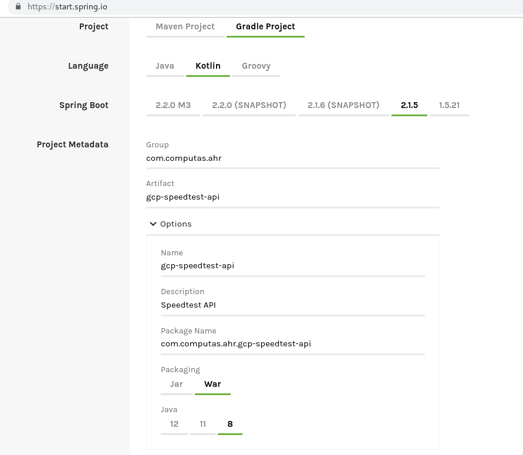
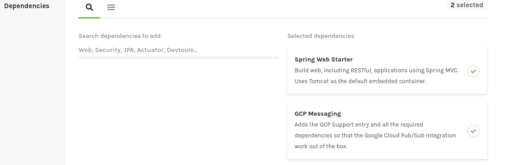
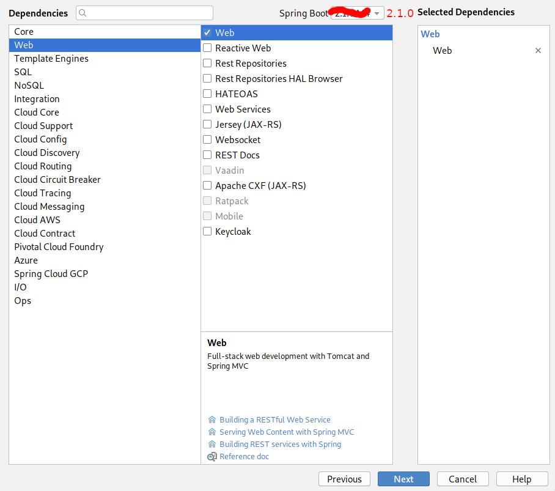
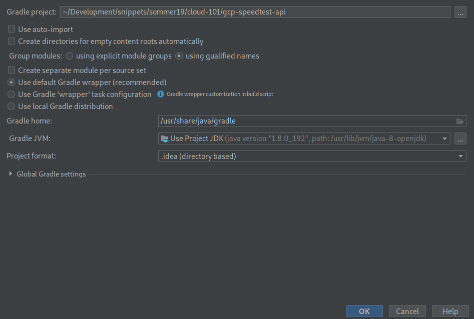
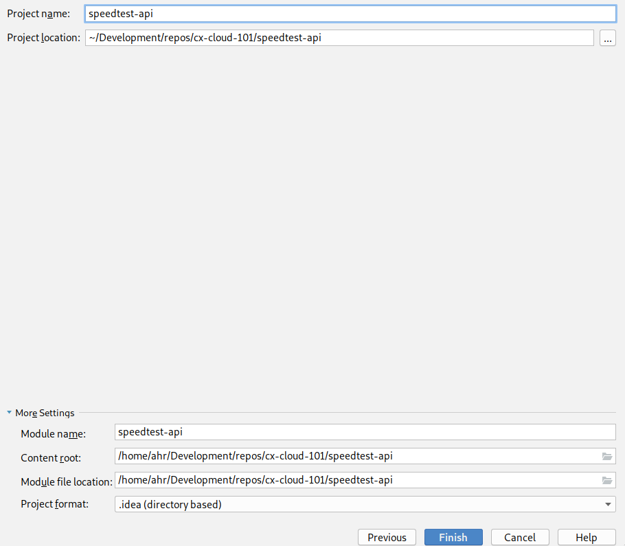
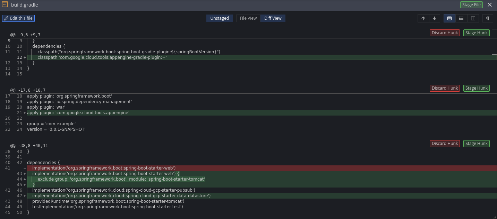

[Home](../README) > [GCP](index) > Love the smell of HTTP in the morning
========================================================================
_This time we'll start with the API. The GCP Speedtest API application is an HTTP API that receives speedtest events and publishes them as Pub/Sub messages to be further processed by other applications._

Suggested implementation
------------------------
We suggest that you implement the Speedtest API as a GCP Appengine Standard Java app using Spring Boot and Spring Cloud. The [reference application](https://github.com/cx-cloud-101/gcp-speedtest-api) is implemented using Kotlin and Gradle as the build tool, you may chose Java 8 and/or maven if you prefer.

### API

__GET /ping__
Should respond with PONG or something similar.

__POST /speedtest__
_Request body:_
```json
{
   "user": "STRING",
   "device": "NUMBER",
   "timestamp": "NUMBER", // epoch time in ms
   "data": {
        "speeds": {
            "download": "NUMBER",
            "upload": "NUMBER"
        },
        "client": {
            "ip": "STRING",
            "lat": "NUMBER",
            "lon": "NUMBER",
            "isp": "STRING",
            "country": "STRING" // (ISO 3166-1_alpha2)
        },
        "server": {
            "host": "STRING",
            "lat": "NUMBER",
            "lon": "NUMBER",
            "country": "STRING", // (ISO 3166-1_alpha2)
            "distance": "NUMBER",
            "ping": "NUMBER",
            "id": "STRING"
        }
    }
}
```

Versioning the code
-------------------
You'll probably want to version your code, so start off by creating a new repo named gcp-speedtest-api.

Getting Started
---------------
This guide assumes that you have Jetbrains IntelliJ Ultimate, if you don't have that you can use IntelliJ Community edition (or your preferred Java IDE) and [Spring Initializr](https://start.spring.io/) as replacement.

1. Create a new Project in IntelliJ
2. Select *Spring Initializr* from the sidebar and continue



3. Select `Gradle` as *Type* and `War` (**Important**) as *Packaging*. On the Spring Initializr website you must click on *Switch to the full version*.



4. Add Spring Web dependency



5. Add Spring Cloud GCP Messaging dependency



6. Click on finish. On the Spring Initializr website you will get a zip-file, extract it and open it as a project in your IDE.



7. Modify `gradle.build` so that it can be deployed as a GCP Appengine Standard Java app
   


8. Add the following files to `/src/webapp/WEB-INF`
   1. appengine-web.xml

```xml
<?xml version="1.0" encoding="UTF-8"?>
<appengine-web-app xmlns="http://appengine.google.com/ns/1.0">
    <threadsafe>true</threadsafe>
    <runtime>java8</runtime>
    <sessions-enabled>true</sessions-enabled>
    <warmup-requests-enabled>true</warmup-requests-enabled>
    <env-variables>
        <env-var name="DEFAULT_ENCODING" value="UTF-8"/>
    </env-variables>
</appengine-web-app>
```

   2. web.xml

```xml    <?xml version="1.0" encoding="utf-8"?>
<web-app xmlns="http://xmlns.jcp.org/xml/ns/javaee"
            xmlns:xsi="http://www.w3.org/2001/XMLSchema-instance"
            xsi:schemaLocation="http://xmlns.jcp.org/xml/ns/javaee
            http://xmlns.jcp.org/xml/ns/javaee/web-app_3_1.xsd"
            version="3.1">

    <servlet>
        <servlet-name>speedtest-api</servlet-name>
        <servlet-class>org.springframework.web.servlet.DispatcherServlet</servlet-class>
        <init-param>
            <param-name>contextAttribute</param-name>
            <param-value>org.springframework.web.context.WebApplicationContext.ROOT</param-value>
        </init-param>
        <load-on-startup>1</load-on-startup>
    </servlet>

    <servlet-mapping>
        <servlet-name>speedtest-api</servlet-name>
        <url-pattern>/*</url-pattern>
    </servlet-mapping>

    <welcome-file-list>
        <welcome-file>index.html</welcome-file>
    </welcome-file-list>

    <security-constraint>
        <web-resource-collection>
            <web-resource-name>all</web-resource-name>
            <url-pattern>/*</url-pattern>
        </web-resource-collection>
        <user-data-constraint>
            <transport-guarantee>CONFIDENTIAL</transport-guarantee>
        </user-data-constraint>
    </security-constraint>

</web-app>
```

Testing the API
---------------
You can easily test your API both locally and by deploying it to your GCP project.

### Add test endpoint
Create a new class with a simple response

**Example**
```kotlin
import org.springframework.web.bind.annotation.GetMapping
import org.springframework.web.bind.annotation.PathVariable
import org.springframework.web.bind.annotation.RequestMapping
import org.springframework.web.bind.annotation.RestController

@RestController
@RequestMapping("/hello")
class HelloResource {

    @GetMapping(path = ["{name}"])
    fun getHello(@PathVariable("name") name: String): String = "Hello $name"
}
```

### Locally
Start the application either by running the `*Application` class in your IDE, or running one of the following gradle commands:
* `./gradlew bootRun`
* `./gradlew appengineRun`

Open: [http://localhost:8080/hello/alex](http://localhost:8080/hello/alex)

### Deploy to GCP
Run `./gradlew appengineDeploy` and open [https://your-project.appspot.com/hello/alex](https://your-project.appspot.com/hello/alex)

Implementing gcp-speedtest-api
------------------------------
The Speedtest API should have an endpoint as described above under "Suggested implementation" and publish the received speedtest events to a Pub/Sub topic.

1. Create pubsub topic `gcloud pubsub topics create speedtest`
2. Read about publishing messages to Pub/Sub topic with Spring Cloud: [Messaging with Google Cloud Pub/Sub](https://spring.io/guides/gs/messaging-gcp-pubsub/)
3. Implement the endpoint

You have an API on GCP. What now?
---------------------------------
Next we'll want to store our speedtest-messages somewhere suitable. Let's continue and [create a Cloud Functions that stores our speedtests in BigQuery](writing-all-the-events)