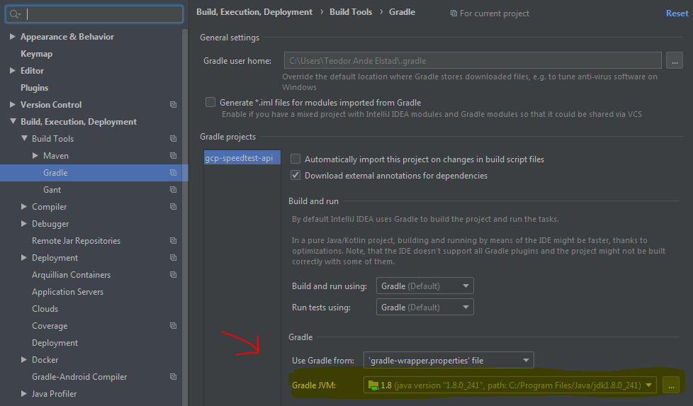

[Home](../) > [GCP](index) > Love the smell of HTTP in the morning
========================================================================
_This time we'll start with the API. The GCP Speedtest API application is an HTTP API that receives speedtest events and publishes them as Pub/Sub messages to be further processed by other applications._

Suggested implementation
------------------------
We suggest that you implement the Speedtest API as a GCP Appengine Standard Java app using Spring Boot and Spring Cloud. The [reference application](https://github.com/cx-cloud-101/gcp-speedtest-api) is implemented using Kotlin and Gradle as the build tool, you may chose Java 8 and/or maven if you prefer.

### API
Implement the following API.

#### GET /ping

Should respond with PONG or something similar.

#### POST /speedtest

_Request body:_
```json
{
   "user": "STRING",
   "device": "NUMBER",
   "timestamp": "NUMBER", // epoch time in ms
   "data": {
        "speeds": {
            "download": "NUMBER",
            "upload": "NUMBER"
        },
        "client": {
            "ip": "STRING?",
            "lat": "NUMBER?",
            "lon": "NUMBER?",
            "isp": "STRING?",
            "country": "STRING?" // (ISO 3166-1_alpha2)
        },
        "server": {
            "host": "STRING?",
            "lat": "NUMBER?",
            "lon": "NUMBER?",
            "country": "STRING?", // (ISO 3166-1_alpha2)
            "distance": "NUMBER?",
            "ping": "NUMBER?",
            "id": "STRING?"
        }
    }
}
```

Versioning the code
-------------------
You'll probably want to version your code. You can either create a new repo named gcp-speedtest-api on GitHub and clone it locally, or you can create a local repo named gcp-speedtest-api as shown below.
```bash
git init gcp-speedtest-api
```

Getting Started
---------------
Use [Spring Initializr](https://start.spring.io/) to generate your project.

1. Select setup of build tool and language. Our examples use Kotlin and Gradle, but you can choose between Java or Kotlin and Gradle or Maven if you prefer something else. Notice the selections in **bold**, especially **war** packaging.

1. Add dependencies: `Spring Web` and `GCP Messaging` 

1. Generate project and unzip the downloaded archive. Copy the unzipped file into your git repo folder.

1. Open IntelliJ, click "Open", and select your git repo folder, containing the unzipped files.
    

1. Open File -> Settings and search for Gradle. Check that the Gradle JVM version is set to the installed Java 8 JDK (shows up as 1.8 in the settings).

1. Modify `pluginManagement` in `settings.gradle.kts` so that Gradle can find the appengine plugin.
    ```kotlin
    rootProject.name = "api"
    
    pluginManagement {
       repositories {
           gradlePluginPortal()
           mavenCentral()
       }
       resolutionStrategy {
           eachPlugin {
               if (requested.id.namespace == "com.google.cloud.tools") {
                   useModule("com.google.cloud.tools:appengine-gradle-plugin:${requested.version}")
               }
           }
       }
}
    ```
    
1. Modify `build.gradle.kts` to invoke the appengine plugin (Add the last line to the `plugins`-section).
    ```kotlin
    plugins {
        // Other plugins omitted
        id("com.google.cloud.tools.appengine") version "2.0.1"
    }
    ```
    
1. Modify `dependencies` in `build.gradle.kts` to exclude tomcat so that it can be deployed to appengine (which uses jetty).
    ```kotlin
    dependencies {
        implementation("org.springframework.boot:spring-boot-starter-web") {
           exclude("org.springframework.boot", "spring-boot-starter-tomcat")
        }
        // Other dependencies omitted
    }
    ```
```
    
1. Add the following to the end of `build.gradle.kts` to configure appengine. (Replace <your-project-id> with the ID of your Google Cloud Project).
    
```
    appengine {
        deploy {
            version = "GCLOUD_CONFIG"
            projectId = "<your-project-id>"
        }
    }
```
    
    _You can find the project ID for your project by looking at the "Project info" tile shown on [console.cloud.google.com/home](https://console.cloud.google.com/home)._
    
    
1. Create the folders `/src/main/webapp/` and `/src/main/webapp/WEB-INF/`. Then add the following two files to `/src/main/webapp/WEB-INF`/
    
    1. `appengine-web.xml`
        
        ```xml
        <?xml version="1.0" encoding="UTF-8"?>
        <appengine-web-app xmlns="http://appengine.google.com/ns/1.0">
            <threadsafe>true</threadsafe>
            <runtime>java8</runtime>
            <sessions-enabled>true</sessions-enabled>
            <warmup-requests-enabled>true</warmup-requests-enabled>
            <env-variables>
                <env-var name="DEFAULT_ENCODING" value="UTF-8"/>
            </env-variables>
    </appengine-web-app>
```

   1. `web.xml`
      
        ```xml
        <?xml version="1.0" encoding="utf-8"?>
        <web-app xmlns="http://xmlns.jcp.org/xml/ns/javaee"
                    xmlns:xsi="http://www.w3.org/2001/XMLSchema-instance"
                    xsi:schemaLocation="http://xmlns.jcp.org/xml/ns/javaee
                    http://xmlns.jcp.org/xml/ns/javaee/web-app_3_1.xsd"
                    version="3.1">
        
            <servlet>
                <servlet-name>speedtest-api</servlet-name>
                <servlet-class>org.springframework.web.servlet.DispatcherServlet</servlet-class>
                <init-param>
                    <param-name>contextAttribute</param-name>
                    <param-value>org.springframework.web.context.WebApplicationContext.ROOT</param-value>
                </init-param>
                <load-on-startup>1</load-on-startup>
            </servlet>
        
            <servlet-mapping>
                <servlet-name>speedtest-api</servlet-name>
                <url-pattern>/*</url-pattern>
            </servlet-mapping>
        
            <welcome-file-list>
                <welcome-file>index.html</welcome-file>
            </welcome-file-list>
        
            <security-constraint>
                <web-resource-collection>
                    <web-resource-name>all</web-resource-name>
                    <url-pattern>/*</url-pattern>
                </web-resource-collection>
                <user-data-constraint>
                    <transport-guarantee>CONFIDENTIAL</transport-guarantee>
                </user-data-constraint>
            </security-constraint>
        
        </web-app>
        ```

Testing the API
---------------

Let's test if all that setup worked as expected.

### Add test endpoint
Create a new class named `HelloResource` under `/src/main/kotlin/com.speedtest.api/`. Implement a simple controller handling a simple GET request.

**Example**

```kotlin
package com.speedtest.api

import org.springframework.web.bind.annotation.GetMapping
import org.springframework.web.bind.annotation.PathVariable
import org.springframework.web.bind.annotation.RequestMapping
import org.springframework.web.bind.annotation.RestController

@RestController
@RequestMapping("/hello")
class HelloResource {

    @GetMapping(path = ["{name}"])
    fun getHello(@PathVariable("name") name: String): String = "Hello $name"
}
```

### Locally
Before we can start out API, we need to generate [Application Default Credentials](https://cloud.google.com/docs/authentication/production) for connecting to GCP. This is needed since the GCP Messaging plugin to Spring Boot will lock for the dependencies, and fail to start if they're not present. To generate the credentials, open a terminal and run the following command.

```shell
$> gcloud auth application-default login
Your browser has been opened to visit:
...
Credentials saved to file:
...
These credentials will be used by any library that requests
Application Default Credentials.
...
```

Start the application either by running the `ApiApplication` class in your IDE, or running one of the following gradle commands:

* `./gradlew bootRun`
* `./gradlew appengineRun`

_All the three ways of starting the application should work, so pick the one that works for you._

If the API started successfully, you should be able to open [http://localhost:8080/hello/speedtest](http://localhost:8080/hello/speedtest) in your browser and get a response.


### Deploy to GCP

If everything went well, you're ready to deploy the API to GCP.

Start by creating an App Engine Application in your GCP Project by running the following command in a terminal, and selecting `europe-west` as the region.

```shell
$> gcloud app create
You are creating an app for project [cloud-101-268020].
WARNING: Creating an App Engine application for a project is irreversible and the region cannot be changed. More information about regions is at <https://cloud.google.com/appengine/docs/locations>.

Please choose the region where you want your App Engine application located:

 [1] asia-east2    (supports standard and flexible)
 [2] asia-northeast1 (supports standard and flexible)
 [3] asia-northeast2 (supports standard and flexible)
 [4] asia-south1   (supports standard and flexible)
 [5] australia-southeast1 (supports standard and flexible)
 [6] europe-west   (supports standard and flexible)
 [7] europe-west2  (supports standard and flexible)
 [8] europe-west3  (supports standard and flexible)
 [9] europe-west6  (supports standard and flexible)
 [10] northamerica-northeast1 (supports standard and flexible)
 [11] southamerica-east1 (supports standard and flexible)
 [12] us-central    (supports standard and flexible)
 [13] us-east1      (supports standard and flexible)
 [14] us-east4      (supports standard and flexible)
 [15] us-west2      (supports standard and flexible)
 [16] cancel
Please enter your numeric choice:  6

Creating App Engine application in project [cloud-101-268020] and region [europe-west]....done.
Success! The app is now created. Please use `gcloud app deploy` to deploy your first app.
```

Navigate to your gcp-speedtest-api repo folder, and use gradle to deploy your app to appengine.

```
$ gcp-speedtest-api> .\gradlew appengineDeploy
Welcome to Gradle 5.6.4!

// A lot more output omitted here

BUILD SUCCESSFUL in 7m 46s
7 actionable tasks: 5 executed, 2 up-to-date
```

_If you get an error saying that `JAVA_HOME` is not set, and that java is missing from `PATH`, you'll need to do both. `JAVA_HOME` should be the folder where you installed the Java SE 8 JDK, e.g. `C:\Program Files\Java\jdk1.8.0_241`. To the `PATH` variable, you'll need to add the `\bin` folder under the `JAVA_HOME` folder. e.g. `C:\Program Files\Java\jdk1.8.0_241\bin`._

If everything worked, you should be able to open [https://your-project-id.appspot.com/hello/speedtest](https://your-project-id.appspot.com/hello/speedtest), replacing "your-project-id" with the ID of your GCP project.


Implementing gcp-speedtest-api
------------------------------
The Speedtest API should have an endpoint as described above under "Suggested implementation" and publish the received speedtest events to a Pub/Sub topic.

### Start with /ping

It should be quite easy to modify `HelloResource` to be a `PingResource` instead. Can you figure out how it should be done?

_Tip: Remember to update the `@RequestMapping(...)` as well as the class name_

### Creating /speedtest

As a start, we're going to create a simplified version of the /speedtest endpoint that only accepts a simple user model. Create another class named `HelloResource` under `/src/main/kotlin/com.speedtest.api/` and add the following code:
```kotlin
package com.speedtest.api

import org.springframework.web.bind.annotation.PostMapping
import org.springframework.web.bind.annotation.RequestBody
import org.springframework.web.bind.annotation.RequestMapping
import org.springframework.web.bind.annotation.RestController

@RestController
@RequestMapping("/speedtest")
class SpeedTestResource {

    data class User(val name: String, val email: String, val telephone: String)

    @PostMapping
    fun createUser(@RequestBody user: User) {
        println(user.name)
    }
}
```

_Note that you can use the kotlin construct `data class` to represent the request body_

Test the partially implemented /speedtest endpoint by using Postman, or a similar tool. It should be able to accept a POST request to  [http://localhost:8080/speedtest](http://localhost:8080/speedtest) with a request body containing JSON along the lines of:

```json
{
    "name": "Alex",
    "email": "email@email.com",
    "telephone": "12345678"
}
```

Now it's up to you to extend the /speedtest endpoint so it will accept a full speedtest result. When you're done, it should be able to receive a JSON request body as shown below:

```json
{
   "user": "gcp-101-testuser",
   "device": 1,
   "timestamp": 1581558456119,
   "data": {
        "speeds": {
            "download": 60.4,
            "upload": 20.7
        },
        "client": {
            "ip": "127.0.0.1",
            "lat": 1.2,
            "lon": 92.7,
            "isp": "Get",
            "country": "no-NB"
        },
        "server": {
            "host": "get.speedtest.net",
            "lat": 1.3,
            "lon": 93.4,
            "country": "no-NB",
            "distance": 3001,
            "ping": 12,
            "id": "42"
        }
    }
}
```


Publish messages to Pub/Sub
---------------------------

Our Spring Boot project already includes the required packages to publish messages to a Pub/Sub topic, but before we can do that, we'll need to create the topic in GCP using `gcloud pubsub`:

```shell
$> gcloud pubsub topics create speedtest
Created topic [projects/you-project-id/topics/speedtest].
```

Spring will automatically inject a bean into the `pubSub` field in the class `SpeedTestResource` below. You can achieve the same in Java by creating a class with the field `private final PubSubTemplate pubSub;` and a constructor that has a `PubSubTemplate` parameter that is assigned to the field. With this in mind, we can extend or API so it sends publishes speedtests to our Pub/Sub topic.
```kotlin
@RestController
@RequestMapping("/speedtest")
class SpeedTestResource(val pubSub: PubSubTemplate) {

    val gson: Gson = Gson()

    // Old code omitted

    @PostMapping
    fun publishTestResult(@RequestBody testResult: TestResult) {
        this.pubSub.publish("speedtest", gson.toJson(testResult))

        // Old code omitted
    }
}
```

Note that we have to serialize the `TestResult` as JSON. This is done with an instance of the Gson library.

Now we can test if we're able to publish events to GCP. Start the API locally, and send a few requests to /speedtest. Then navigate to [console.cloud.google.com/cloudpubsub/topic](https://console.cloud.google.com/cloudpubsub/topic), and after a little while you should see your messages appear under the speedtest topic.


If everything went well, you can publish the updated API to GCP with `.\gradlew appengineDeploy` in the folder`/gcp-speedtest-api`, and test that it works there as well. Check n your changes and/or push them to github if you feel like doing that.

You have an API on GCP. What now?
---------------------------------

Next we'll want to store our speedtest-messages somewhere suitable. Let's continue and [create a Cloud Functions that stores our speedtests in BigQuery](writing-all-the-events)
