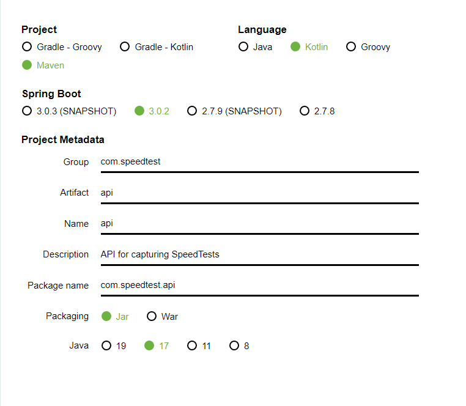

[Home](../) > [GCP](index) > Love the smell of HTTP in the morning
========================================================================
_This time we'll start with the API. The GCP Speedtest API application is an HTTP API that receives speedtest events and publishes them as Pub/Sub messages to be further processed by other applications._

Suggested implementation
------------------------
We suggest that you implement the Speedtest API as a Cloud Run using Spring Boot and Spring Cloud. 
The [reference application](https://github.com/cx-cloud-101/gcp-speedtest/tree/main/api) is implemented using Kotlin and Maven as the build tool, you may choose Java and/or Gradle if you prefer.

### API
Implement the following API.

#### GET /ping

Should respond with PONG or something similar.

#### POST /speedtest

_Request body:_
```json
{
   "user": "STRING",
   "device": "NUMBER",
   "timestamp": "NUMBER", // epoch time in s
   "data": {
        "speeds": {
            "download": "NUMBER", // bits per second (bps)
            "upload": "NUMBER" // bps
        },
        "client": {
            "ip": "STRING?",
            "lat": "NUMBER?",
            "lon": "NUMBER?",
            "isp": "STRING?",
            "country": "STRING?" // (ISO 3166-1_alpha2)
        },
        "server": {
            "host": "STRING?",
            "lat": "NUMBER?",
            "lon": "NUMBER?",
            "country": "STRING?", // (ISO 3166-1_alpha2)
            "distance": "NUMBER?",
            "ping": "NUMBER?",
            "id": "STRING?"
        }
    }
}
```

Versioning the code
-------------------
You'll probably want to version your code. You can either create a new repo named gcp-speedtest-api on GitHub and clone it locally, or you can create a local repo named gcp-speedtest-api as shown below.
```bash
git init gcp-speedtest-api
```

Getting Started
---------------
Use [Spring Initializr](https://start.spring.io/) to generate your project.

1. Select setup of build tool and language. Our examples use Kotlin and Maven, but you can choose between Java or Kotlin and Gradle or Maven if you prefer something else. Notice the selections in **bold**, especially **jar** packaging. \


2. Add dependencies: `Spring Web` and `GCP Messaging` \


3. Generate project and unzip the downloaded archive. Copy the unzipped `api` folder (whole folder) into your git repo folder.

4. Open IntelliJ, click "Open", and select your git repo folder, containing the unzipped files. \
    


Testing the API
---------------

Let's test if all that setup worked as expected.

### Add test endpoint
Create a new class named `HelloResource` under `/src/main/kotlin/com.speedtest.api/`. Implement a simple controller handling a simple GET request.

**Example**

```kotlin
package com.speedtest.api

import org.springframework.web.bind.annotation.GetMapping
import org.springframework.web.bind.annotation.PathVariable
import org.springframework.web.bind.annotation.RequestMapping
import org.springframework.web.bind.annotation.RestController

@RestController
@RequestMapping("/hello")
class HelloResource {

    @GetMapping(path = ["{name}"])
    fun getHello(@PathVariable("name") name: String): String = "Hello $name"
}
```

### Locally
Before we can start out API, we need to generate [Application Default Credentials](https://cloud.google.com/docs/authentication/production) for connecting to GCP. This is needed since the GCP Messaging plugin to Spring Boot will lock for the dependencies, and fail to start if they're not present. To generate the credentials, open a terminal and run the following command.

```shell
$> gcloud auth application-default login
Your browser has been opened to visit:
...
Credentials saved to file:
...
These credentials will be used by any library that requests
Application Default Credentials.
...
```

Start the application either by running the `ApiApplication` class in your IDE, or run the following maven command:

* `mvn spring-boot:run`

_Both ways of starting the application should work, so pick the one that works for you._

If the API started successfully, you should be able to open [http://localhost:8080/hello/speedtest](http://localhost:8080/hello/speedtest) in your browser and get a response.


### Secure it!
You're nearly ready to deploy to Cloud Run! We want the Cloud Run application to be invoked by any user.
When you create a Cloud Run it will use a default service account to gain access to GCP resources. This default service
account has editor access to your GCP projects which gives it access to quite a lot of resources. 
Following the security principle of least privilege we want to use a service account created only for this Cloud Run
with the minimum requirement it needs. To create a service account run:
```shell
gcloud iam service-accounts create some-account-name --display-name="My Service Account"
```
We can then deploy our Cloud Run with this service account.

### Deploy to Cloud Run

If everything went well, you're ready to deploy the API to Cloud Run.
We want to build the Docker image and deploy it as a Cloud Run.
All of this can be done for us using Cloud Build! 
In the root of your project create a file called `cloudbuild.yaml`. Here we will define all the steps that we want the build to execute. 
The first step is to create a Docker image. Add the following to the Cloud Build file:
```yaml
steps:
  - name: 'gcr.io/cloud-builders/docker'
    args: ['build', '-t', 'gcr.io/$PROJECT_ID/speedtest-api', '.']
images: ['gcr.io/$PROJECT_ID/speedtest-api']
```
The PROJECT_ID is a globally set environment variable in cloud build and will auto resolve to your GCP project.
To start your build run:
```shell
gcloud builds submit .
```
If this runs successfully you should be able to see the image in the container registry under the folder speedtest-api.
Next step is to deploy it to Cloud Run. To do this we need the gcloud image from Cloud Build and then add the appropriate arguments to the step.
```yaml
steps:
  - name: 'gcr.io/cloud-builders/docker'
    args: ['build', '-t', 'gcr.io/$PROJECT_ID/speedtest-api', '.']
  - name: 'gcr.io/google.com/cloudsdktool/cloud-sdk'
    entrypoint: gcloud
    args: [ ... ]
images: ['gcr.io/$PROJECT_ID/speedtest-api']
```

The args will be similar to writing a `gcloud run deploy` in the terminal, so try to add the proper arguments to deploy it.
Consider getting the proper image, deploying in the correct region, making it available for unauthenticated users
and setting the Cloud Run service account that you created earlier. 
Hint you can use `gcloud --help` to see the options that are available.

When you've added the arguments you should be ready for another submit. 
If this is successful you should get a Cloud Run service under the Cloud Run tab in GCP. By clicking on it you should be
able to see the url where you can post you request.

 \
By adding /hello/speedtest to the url you should be able to make a call to the api.

Implementing gcp-speedtest-api
------------------------------

The Speedtest API should have an endpoint as described above under "Suggested implementation" and publish the received speedtest events to a Pub/Sub topic.

### Start with /ping

It should be quite easy to modify `HelloResource` to be a `PingResource` instead. Can you figure out how it should be done?

_Tip: Remember to update the `@RequestMapping(...)` as well as the class name_

### Creating /speedtest

As a start, we're going to create a simplified version of the /speedtest endpoint that only accepts a simple user model. Create another class named `SpeedTestResource` under `/src/main/kotlin/com.speedtest.api/` and add the following code:
```kotlin
package com.speedtest.api

import org.springframework.web.bind.annotation.PostMapping
import org.springframework.web.bind.annotation.RequestBody
import org.springframework.web.bind.annotation.RequestMapping
import org.springframework.web.bind.annotation.RestController

@RestController
@RequestMapping("/speedtest")
class SpeedTestResource {

    data class User(val name: String, val email: String, val telephone: String)

    @PostMapping
    fun createUser(@RequestBody user: User) {
        println(user.name)
    }
}
```

_Note that you can use the kotlin construct `data class` to represent the request body_

Test the partially implemented /speedtest endpoint by using Postman, or a similar tool. It should be able to accept a POST request to  [http://localhost:8080/speedtest](http://localhost:8080/speedtest) with a request body containing JSON along the lines of:

```json
{
    "name": "Alex",
    "email": "email@email.com",
    "telephone": "12345678"
}
```

Now it's up to you to extend the /speedtest endpoint, so it will accept a full speedtest result. When you're done, it should be able to receive a JSON request body as shown below:

```json
{
   "user": "gcp-101-testuser",
   "device": 1,
   "timestamp": 1581558456,
   "data": {
        "speeds": {
            "download": 60.4,
            "upload": 20.7
        },
        "client": {
            "ip": "127.0.0.1",
            "lat": 1.2,
            "lon": 92.7,
            "isp": "Get",
            "country": "no-NB"
        },
        "server": {
            "host": "get.speedtest.net",
            "lat": 1.3,
            "lon": 93.4,
            "country": "no-NB",
            "distance": 3001,
            "ping": 12,
            "id": "42"
        }
    }
}
```


Publish messages to Pub/Sub
---------------------------

Our Spring Boot project already includes the required packages to publish messages to a Pub/Sub topic, but before we can do that, we'll need to create the topic in GCP using `gcloud pubsub`:

```shell
$> gcloud pubsub topics create speedtest
Created topic [projects/you-project-id/topics/speedtest].
```
If we want our Cloud Run to be able to publish messages to this topic the proper IAM role must be added to the service account that we've created.
This can be done by running:
```
gcloud pubsub topics add-iam-policy-binding <TOPIC_NAME> --member='serviceAccount:some-account-name@<PROJECT_ID>.iam.gserviceaccount.com' --role='roles/pubsub.publisher'
```
Spring will automatically inject a bean into the `pubSub` field in the class `SpeedTestResource` below. We can now extend the API, so it sends publishes speedtests to our Pub/Sub topic.
```kotlin
@RestController
@RequestMapping("/speedtest")
class SpeedTestResource(val pubSub: PubSubTemplate) {

    val gson: Gson = Gson()

    // Old code omitted

    @PostMapping
    fun publishTestResult(@RequestBody testResult: TestResult) {
        this.pubSub.publish("speedtest", gson.toJson(testResult))

        // Old code omitted
    }
}
```

Note that we have to serialize the `TestResult` as JSON. This is done with an instance of the Gson library.

Now we can test if we're able to publish events to GCP. Start the API locally, and send a few requests to /speedtest. Then navigate to [console.cloud.google.com/cloudpubsub/topic](https://console.cloud.google.com/cloudpubsub/topic), and after a little while you should see your messages appear under the speedtest topic.


If everything went well, you can publish the updated API to GCP with `gcloud builds submit .` in the folder`/gcp-speedtest-api/api`, and test that it works there as well. Check in your changes and/or push them to GitHub if you feel like doing that.

You have an API on GCP. What now?
---------------------------------

Next we'll want to store our speedtest-messages somewhere suitable. Let's continue and [create a Cloud Functions that stores our speedtests in BigQuery](writing-all-the-events-python)
