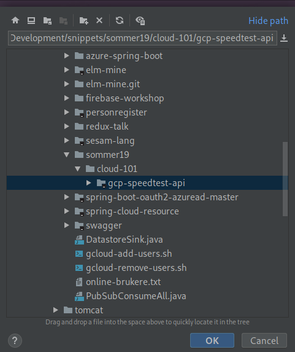

[Home](../) > [GCP](index) > Love the smell of HTTP in the morning
========================================================================
_This time we'll start with the API. The GCP Speedtest API application is an HTTP API that receives speedtest events and publishes them as Pub/Sub messages to be further processed by other applications._

Suggested implementation
------------------------
We suggest that you implement the Speedtest API as a GCP Appengine Standard Java app using Spring Boot and Spring Cloud. The [reference application](https://github.com/cx-cloud-101/gcp-speedtest-api) is implemented using Kotlin and Gradle as the build tool, you may chose Java 8 and/or maven if you prefer.

### API
Implement the following API.

#### GET /ping

Should respond with PONG or something similar.

#### POST /speedtest

_Request body:_
```json
{
   "user": "STRING",
   "device": "NUMBER",
   "timestamp": "NUMBER", // epoch time in ms
   "data": {
        "speeds": {
            "download": "NUMBER",
            "upload": "NUMBER"
        },
        "client": {
            "ip": "STRING?",
            "lat": "NUMBER?",
            "lon": "NUMBER?",
            "isp": "STRING?",
            "country": "STRING?" // (ISO 3166-1_alpha2)
        },
        "server": {
            "host": "STRING?",
            "lat": "NUMBER?",
            "lon": "NUMBER?",
            "country": "STRING?", // (ISO 3166-1_alpha2)
            "distance": "NUMBER?",
            "ping": "NUMBER?",
            "id": "STRING?"
        }
    }
}
```

Versioning the code
-------------------
You'll probably want to version your code, so start off by creating a new repo named gcp-speedtest-api.
```bash
git init gcp-speedtest-api
```

Getting Started
---------------
Use [Spring Initializr](https://start.spring.io/) to generate your project.

1. Select setup of build tool and language. Our examples use Kotlin and Gradle, but you can choose between Java or Kotlin and Gradle or Maven if you prefer something else. Notice the selections in **bold**, especially **war** packaging. 

1. Add dependencies: `Spring Web Starter` and `GCP Messaging` 

1. Generate project and unzip the downloaded archive.

1. Open IntelliJ, click on File -> Open and select the unzipped generated project. 

1. Uncheck `Create separate module per source set` and click `OK`. 

1. Modify `pluginManagement` in `settings.gradle.kts` so that Gradle can find the appengine plugin.
    ```kotlin
    pluginManagement {
       repositories {
           gradlePluginPortal()
           mavenCentral()
       }
       resolutionStrategy {
           eachPlugin {
               if (requested.id.namespace == "com.google.cloud.tools") {
                   useModule("com.google.cloud.tools:appengine-gradle-plugin:${requested.version}")
               }
           }
       }
    }
    ```

1. Modify `build.gradle.kts` to invoke the appengine plugin (Add the last line to the `plugins`-section).
    ```kotlin
    plugins {
        id("org.springframework.boot") version "2.1.5.RELEASE"
        id("io.spring.dependency-management") version "1.0.7.RELEASE"
        war
        kotlin("jvm") version "1.2.71"
        kotlin("plugin.spring") version "1.2.71"
        id("com.google.cloud.tools.appengine") version "2.0.1"
    }
    ```
    
1. Modify `dependencies` in `build.gradle.kts` to exclude tomcat so that it can be deployed to appengine (which uses jetty).
    ```kotlin
    dependencies {
        implementation("org.springframework.boot:spring-boot-starter-web") {
           exclude("org.springframework.boot", "spring-boot-starter-tomcat")
        }
    }
    ```

1. Add the following to the end of `build.gradle.kts` to configure appengine. (Replace <your-project-id> with the ID of your Google Cloud Project).
    ```
    appengine {
        deploy {
            version = "GCLOUD_CONFIG"
            project = "<your-project-id>"
        }
    }
    ```

1. Add the following files to `/src/main/webapp/WEB-INF`
    1. appengine-web.xml
        ```xml
        <?xml version="1.0" encoding="UTF-8"?>
        <appengine-web-app xmlns="http://appengine.google.com/ns/1.0">
            <threadsafe>true</threadsafe>
            <runtime>java8</runtime>
            <sessions-enabled>true</sessions-enabled>
            <warmup-requests-enabled>true</warmup-requests-enabled>
            <env-variables>
                <env-var name="DEFAULT_ENCODING" value="UTF-8"/>
            </env-variables>
        </appengine-web-app>
        ```

   1. web.xml
        ```xml
        <?xml version="1.0" encoding="utf-8"?>
        <web-app xmlns="http://xmlns.jcp.org/xml/ns/javaee"
                    xmlns:xsi="http://www.w3.org/2001/XMLSchema-instance"
                    xsi:schemaLocation="http://xmlns.jcp.org/xml/ns/javaee
                    http://xmlns.jcp.org/xml/ns/javaee/web-app_3_1.xsd"
                    version="3.1">
        
            <servlet>
                <servlet-name>speedtest-api</servlet-name>
                <servlet-class>org.springframework.web.servlet.DispatcherServlet</servlet-class>
                <init-param>
                    <param-name>contextAttribute</param-name>
                    <param-value>org.springframework.web.context.WebApplicationContext.ROOT</param-value>
                </init-param>
                <load-on-startup>1</load-on-startup>
            </servlet>
        
            <servlet-mapping>
                <servlet-name>speedtest-api</servlet-name>
                <url-pattern>/*</url-pattern>
            </servlet-mapping>
        
            <welcome-file-list>
                <welcome-file>index.html</welcome-file>
            </welcome-file-list>
        
            <security-constraint>
                <web-resource-collection>
                    <web-resource-name>all</web-resource-name>
                    <url-pattern>/*</url-pattern>
                </web-resource-collection>
                <user-data-constraint>
                    <transport-guarantee>CONFIDENTIAL</transport-guarantee>
                </user-data-constraint>
            </security-constraint>
        
        </web-app>
        ```

Testing the API
---------------
You can easily test your API both locally and by deploying it to your GCP project.

### Add test endpoint
Create a new class with a simple response

**Example**

```kotlin
import org.springframework.web.bind.annotation.GetMapping
import org.springframework.web.bind.annotation.PathVariable
import org.springframework.web.bind.annotation.RequestMapping
import org.springframework.web.bind.annotation.RestController

@RestController
@RequestMapping("/hello")
class HelloResource {

    @GetMapping(path = ["{name}"])
    fun getHello(@PathVariable("name") name: String): String = "Hello $name"
}
```

### Locally
Start the application either by running the `*Application` class in your IDE, or running one of the following gradle commands:
* `./gradlew bootRun`
* `./gradlew appengineRun`

(All the three ways of starting the application should work, and it is preferable that you test them all).

Open: [http://localhost:8080/hello/alex](http://localhost:8080/hello/alex)

### Deploy to GCP
1. Create an Appengine Application in your GCP Project: `gcloud app create`
    1. Select `europe-west` as region.
    
1. Run `./gradlew appengineDeploy` and open [https://your-project.appspot.com/hello/alex](https://your-project.appspot.com/hello/alex)

Implementing gcp-speedtest-api
------------------------------
The Speedtest API should have an endpoint as described above under "Suggested implementation" and publish the received speedtest events to a Pub/Sub topic.

1. Create pubsub topic `gcloud pubsub topics create speedtest`
2. Read about publishing messages to Pub/Sub topic with Spring Cloud below.
3. Implement the endpoint
    1. Note that you can use kotlin `data class` to represent the request body
        ```kotlin
        data class User(val name: String, val email: String, val telephone: String)
 
        @PostMapping
        fun createUser(@RequestBody user: User) {
           // Do something with the user ...
           // This endpoint will accept a json payload like: { "name": "Alex", "email": "email@email.com", "telephone": "12345678" }
        }
        ``` 

Publish messages to Pub/Sub
---------------------------
With the Spring GCP Pub/Sub library you can easily publish messages to a topic.

Spring will automatically inject a bean into the `pubSub` field in the class `MyPubSubMessages` below. You can achieve the same in Java by creating a class with the field `private final PubSubTemplate pubSub;` and a constructor that has a `PubSubTemplate` parameter that is assigned to the field.
```kotlin
class MyPubSubMessages(val pubSub: PubSubTemplate) {
   
   fun publish(myMessage: String) {
      this.pubSub.publish("the_topic_name", myMessage) 
   }
   
}
```

You have an API on GCP. What now?
---------------------------------
Next we'll want to store our speedtest-messages somewhere suitable. Let's continue and [create a Cloud Functions that stores our speedtests in BigQuery](writing-all-the-events)
