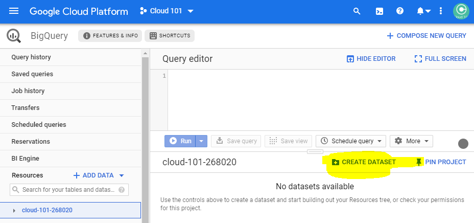
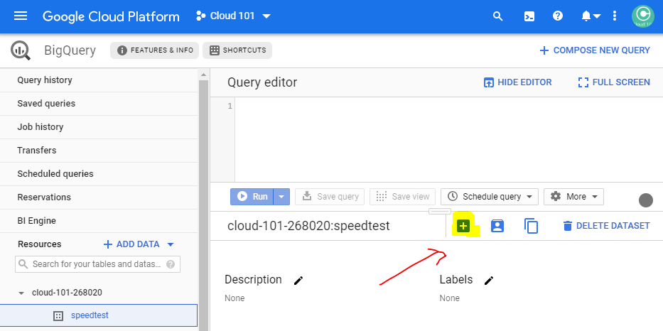
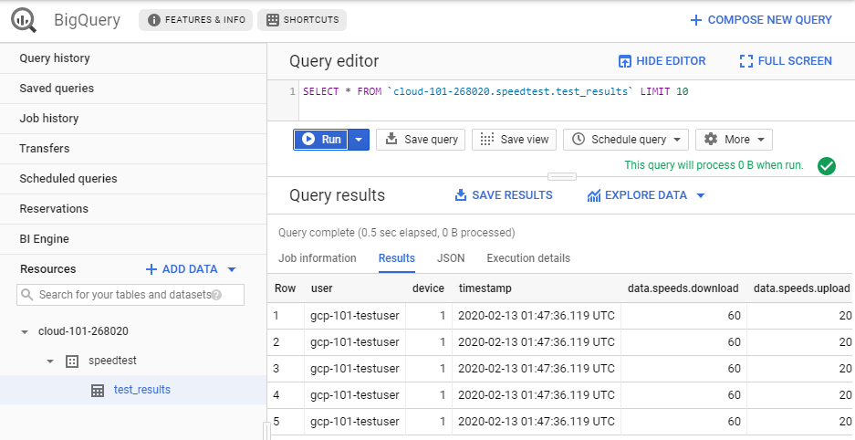

[Home](../) > [GCP](index) > Writing all the events
=========================================================
_The GCP Event Writer is a Cloud Function that subscribes to Speedtest Event messages on a Pub/Sub topic and writes them as rows in a BigQuery table._

Suggested implementation
------------------------
Cloud Functions can be written either as Node.js >= 12 or Python >= 3.7.0, we suggest that you use Python.

As previously described, the Event Writer will receive messages in the following format.

```json
{
   "user": "STRING",
   "device": "NUMBER",
   "timestamp": "NUMBER", // epoch time in ms
   "data": {
        "speeds": {
            "download": "NUMBER",
            "upload": "NUMBER"
        },
        "client": {
            "ip": "STRING",
            "lat": "NUMBER",
            "lon": "NUMBER",
            "isp": "STRING",
            "country": "STRING" // (ISO 3166-1_alpha2)
        },
        "server": {
            "host": "STRING",
            "lat": "NUMBER",
            "lon": "NUMBER",
            "country": "STRING", // (ISO 3166-1_alpha2)
            "distance": "NUMBER",
            "ping": "NUMBER",
            "id": "STRING"
        }
    }
}
```

When the Event Writer receives a message, it should write the content of the message to a table in BigQuery.

Versioning the code
-------------------
As with all other code, you probably want to version your code, so start off by creating a new repo named gcp-event-writer, either on GitHub, or just locally.

Development guide
-----------------
### Setting up the Python environment

A Python project often defines its dependency libraries in a file called `requirements.txt`. This file is used by the `pip` tool to install 
the dependencies. The `pip` tool is a popular package manager for Python, and is included in every Python version since 3.4. As you should have installed
Python3 as part of the prerequisites, you should have `pip` installed already. 

It is common to use a virtual environment when developing Python code. A virtual environment is a directory that contains a Python installation for 
a specific project and has its own set of libraries. If you use a virtual environment manager like Conda or Poetry, you should make a new environment for
this repo. If not, the system Python installation or the standard one downloaded should be fine.

For this Cloud Function, the only dependency library we will need is the GCP BigQuery library, called `google-cloud-bigquery`.
Go ahead and create the `requirements.txt` file and add `google-cloud-bigquery` to it. We then install the dependency by 
running `python3 -m pip install -r requirements.txt`.

### Rigging the project for Cloud Functions

The Cloud Function Python runtime expects a file called `main.py` to be present in the root of the project. This file can call functions in 
other files, but is always the entry file for the function. The entry function within that file is configurable in the deployment. 

In addition, Cloud Functions will look for the `requirements.txt` file in the root of the project, and install the dependencies listed before running 
the function.

Let's start by making the `main.py` file. 

```python
import json
import base64

def main(event, context):
    """Triggered from a message on the speedtest Cloud Pub/Sub topic.
    Args:
        event (dict): Event payload.
        context (google.cloud.functions.Context): Metadata for the event.
    """
    
    # Decode from byte array
    pubsub_message = json.loads(base64.b64decode(event['data']).decode('utf-8'))
```
Notice how the received `event` is processed through `base64.decode` before it is read with the `json` library. The `event.['data']` 
value is a base64 encoded string of the published message. PubSub will always encode messages down to byte arrays before sending them,
so decoding is needed before further use.

An important concept to understand with how Cloud Functions are executed is that they are only allocated compute time as long as they are running. 
As soon as the function returns something the function will be terminated. 

### A table in BigQuery
Navigate to [console.cloud.google.com/bigquery](https://console.cloud.google.com/bigquery) and create a new BigQuery dataset named `speedtest`. We recommend choosing a location close to your Cloud Run instance, `eu (multiple regions in European Union)`



Then create a table named `test_results` in the created dataset, using either the suggested schema or your own.



If you want to use the suggested schema, just paste the following schema in as text when creating the table.


```json
[
  {"type":"STRING","name":"user"},
  {"type":"INTEGER","name":"device"},
  {"type":"TIMESTAMP","name":"timestamp"},
  {
    "name": "data",
    "type": "RECORD",
    "mode": "REQUIRED",
    "fields": [
      {
        "name": "speeds",
        "type": "RECORD",
        "fields": [
          {
            "name": "download",
            "type": "NUMERIC",
            "mode": "NULLABLE"
          },
          {
            "name": "upload",
            "type": "NUMERIC",
            "mode": "NULLABLE"
          }
        ],
        "mode": "NULLABLE"
      },
      {
        "name": "client",
        "type": "RECORD",
        "fields": [
          {
            "name": "ip",
            "type": "STRING",
            "mode": "NULLABLE"
          },
          {
            "name": "lat",
            "type": "NUMERIC",
            "mode": "NULLABLE"
          },
          {
            "name": "lon",
            "type": "NUMERIC",
            "mode": "NULLABLE"
          },
          {
            "name": "isp",
            "type": "STRING",
            "mode": "NULLABLE"
          },
          {
            "name": "country",
            "type": "STRING",
            "mode": "NULLABLE"
          }
        ],
        "mode": "NULLABLE"
      },
      {
        "name": "server",
        "type": "RECORD",
        "fields": [
          {
            "name": "host",
            "type": "STRING",
            "mode": "NULLABLE"
          },
          {
            "name": "lat",
            "type": "NUMERIC",
            "mode": "NULLABLE"
          },
          {
            "name": "lon",
            "type": "NUMERIC",
            "mode": "NULLABLE"
          },
          {
            "name": "country",
            "type": "STRING",
            "mode": "NULLABLE"
          },
          {
            "name": "distance",
            "type": "NUMERIC",
            "mode": "NULLABLE"
          },
          {
            "name": "ping",
            "type": "NUMERIC",
            "mode": "NULLABLE"
          },
          {
            "name": "id",
            "type": "STRING",
            "mode": "NULLABLE"
          }
        ],
        "mode": "NULLABLE"
      }
    ]
  }
]
```

### Implementing the insertion into BigQuery

Now we are ready to implement the insertion of the message data to our newly created table. We will use the BigQuery Python library to do this.

Start by importing all libraries we need, and some constants declaring your GCP project, dataset and table.

```python
import json
import base64
import datetime
from google.cloud import bigquery

# Project ID
project_id = "sfl-cloud-101" # Replace with your project id

# Make BigQuery client
bq_client = bigquery.Client(project=project_id)
table_id = f"{project_id}.speedtest.test_results"
```

Now we want to parse the message data and insert the result to BigQuery.

```python
def main(event, context):
    """Triggered from a message on the speedtest Cloud Pub/Sub topic.
    Args:
        event (dict): Event payload.
        context (google.cloud.functions.Context): Metadata for the event.
    """
    
    # Decode from bytearray
    pubsub_message = json.loads(base64.b64decode(event['data']).decode('utf-8'))

    # Convert timestamp to ISO format
    pubsub_message['timestamp'] = datetime.datetime.fromtimestamp(int(pubsub_message['timestamp'])).isoformat()

    # Insert to bq
    errors = bq_client.insert_rows_json(table_id, [pubsub_message])

     if errors != []:
        print("Message processing failed. Error:", errors)
    else:
        print('Message processed.')
```

Note that the `timestamp` field from the received message is converted to ISO format before being inserted to BigQuery. BigQuery expects a 
timestamp in a string format, and not a raw integer value.

Also note that the `insert_rows_json` method returns a list of errors, if any. If the list is empty, the insertion was successful.
If not, we print the error message.

With all that done, we are ready to deploy gcp-event-writer to GCP and see if it works.


Deploying the Event Writer
--------------------------

To deploy gcp-event-writer to Google Cloud Platform you'll need to use the terminal command `gcloud functions deploy`:

```shell
$ gcp-event-writer> gcloud functions deploy processSpeedtestEvent --trigger-topic speedtest --entry-point main --runtime python3.10 --region europe-west1

API [cloudfunctions.googleapis.com] not enabled on project
[1050850001017]. Would you like to enable and retry (this will take a
few minutes)? (y/N)?  y
...
API [cloudfunctions.googleapis.com] not enabled on project
[1050850001017]. Would you like to enable and retry (this will take a
few minutes)? (y/N)?  y
...
Deploying function (may take a while - up to 2 minutes)...done.
...
status: ACTIVE
timeout: 60s
updateTime: '2020-02-13T03:58:15Z'
versionId: '2'
```
Deploying a new Cloud Function takes a few minutes, so while we wait, lets have a look at what the different parameter to `gcloud functions deploy` are.

`processSpeedtestEvent` is the name the function will have in your GCP project.

The `--trigger-topic` flag is used to specify the Cloud Pub/Sub topic to trigger the function. In our case, it is the `speedtest` topic created earlier.

The `--runtime python3.10` flag specifies that the function will be executed using Python 3.10.

The `--entry-point` flag is used to specify the function name to run when triggered. In our case, it is `main`.

### When you're done

When the deployment is complete, you can view your new function at [console.cloud.google.com/functions](https://console.cloud.google.com/functions).


Then for the most exiting part. POST a few speedtest results to gcp-speedtest-api and check if the event writer actually is able to write the test results to BigQuery.



## What's next?

You now have a system with an API that can receive speedtest results, and a system for storing these results in Big Query. Next we'll [create a logger](return-of-the-logger-python) so we can get some real results.
