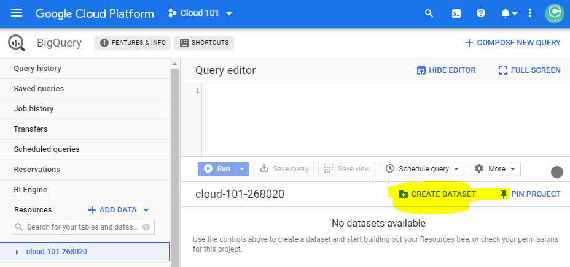
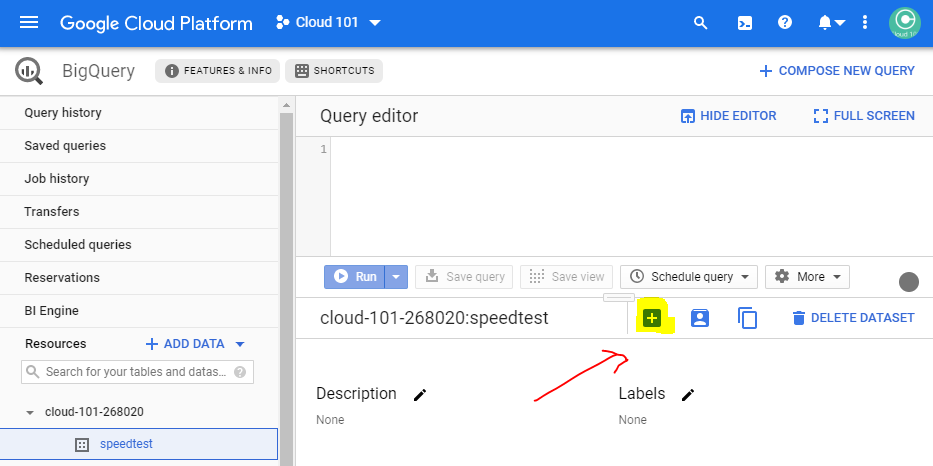
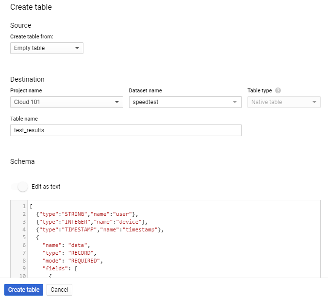
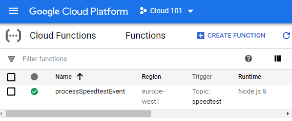
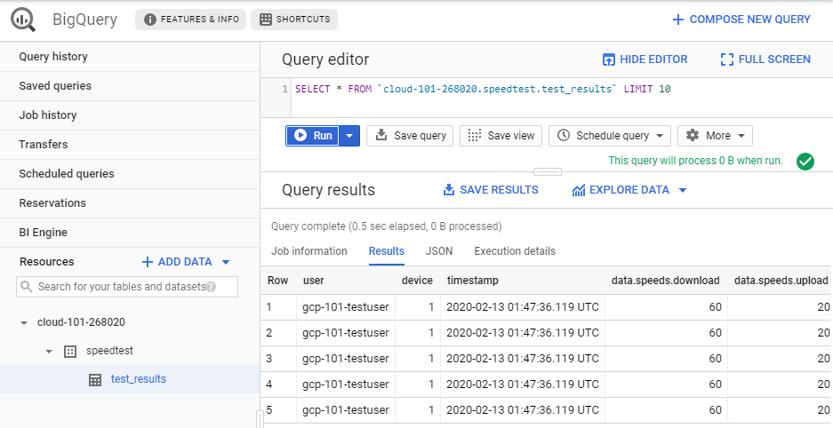

[Home](../) > [GCP](index) > Writing all the events
=========================================================
_The GCP Event Writer is a cloud function that subscribes to Speedtest Event messages on a Pub/Sub topic and writes them as rows in a BigQuery table._

Suggested implementation
------------------------
Cloud Functions can be written either as Node.js >= 12 or Python >= 3.7.0, we suggest that you use Node.js.

As previously described, the Event Writer will receive messages in the following format.

```json
{
   "user": "STRING",
   "device": "NUMBER",
   "timestamp": "NUMBER", // epoch time in ms
   "data": {
        "speeds": {
            "download": "NUMBER",
            "upload": "NUMBER"
        },
        "client": {
            "ip": "STRING",
            "lat": "NUMBER",
            "lon": "NUMBER",
            "isp": "STRING",
            "country": "STRING" // (ISO 3166-1_alpha2)
        },
        "server": {
            "host": "STRING",
            "lat": "NUMBER",
            "lon": "NUMBER",
            "country": "STRING", // (ISO 3166-1_alpha2)
            "distance": "NUMBER",
            "ping": "NUMBER",
            "id": "STRING"
        }
    }
}
```

When the Event Writer receives a message, it should write the content of the message to a table in BigQuery.

Versioning the code
-------------------
As with all other code, you probably want to version your code, so start off by creating a new repo named gcp-event-writer, either on GitHub, or just locally.

Development guide
-----------------
### Creating a nodejs project

Nodejs organizes projects by using a `package.json` file. Here you'll find information about dependencies, a lot of metadata, and more. Given a `package.json` file, the command `npm` (node package manager) will be able to download the libraries declared as dependencies.

Lets start our Cloud Function adventure by creating a `package.json` file in our gcp-event-writer repo folder.

```json
{
  "name": "gcp-event-writer",
  "version": "0.0.1",
  "description": "Serverless function that writes messages from PubSub into BigQuery",
  "engines": {
    "node": "^16"
  },
  "repository": {
    "type": "git",
    "url": "https://github.com/gcp-testbruker/gcp-event-writer"
  },
  "author": "GCP Testbruker",
  "license": "MIT",
  "dependencies": {
    "@google-cloud/bigquery": "^5.9.1"
  }
}
```
Now you should be able to restore dependencies by using `npm install`.

```shell
$ gcp-event-writer> npm install
npm WARN deprecated request@2.88.2: request has been deprecated, see https://github.com/request/request/issues/3142
npm notice created a lockfile as package-lock.json. You should commit this file.
added 112 packages from 137 contributors and audited 342 packages in 11.287s
found 0 vulnerabilities
```

This will, among other things, create a `node_modules` filder, containing the `@google-cloud/bigquery` library, and all the libraries that this library depends on.

### Rigging the project for Cloud Functions

The Cloud Functions nodejs runtime expects that you have an `index.js` at the root of the project which exports functions that wil be called by when the Cloud Function is executed.

In addition Cloud Functions require `package.json` to declare `engines`, determining the nodejs that should be used.

Let's start by creating the `index.js` file.

```js
const speedtest = require('./speedtest');

exports.processSpeedtestEvent = async (pubSubMessage) => {
  if (pubSubMessage.data) {
      const speedtestEvent = Buffer.from(pubSubMessage.data, 'base64').toString();
      await speedtest.handleSpeedtestEvent(JSON.parse(speedtestEvent));
  }
};
```
Notice how the received `pubSubMessage` is processed through `Buffer.from`. The `pubSubMessage.data` value is a base64 encoded string of the published message.

An important concept to understand with how Cloud Functions are executed is that they are only allocated compute time as long as they are running. As soon as the function returns something the function will be terminated, which can be tricky since most operations that you perform in Node.js are asynchronous.

The exception to this rule is that any returned promise will be allowed to resolve. Which is why, as you can note from the above example, the `processSpeedtestEvent` function is declared `async`. You must apply this to any function you implement that performs some asynchronous operation. Always return a promise, and declare your functions `async` if you want/need to use the `await` functionality. If you don't already know, the `await <promise>` statement waits for the passed promise to resolve, then continues execution of the function. It is analogous to writing `<promise>.then(() => <the rest of the function>)`. A function that is declared `async` will automatically return a promise that resolves when all the `await` statements in it has resolved. You could also define your own promise that you return.

### Why require('speedtest')?
At the moment we don't have any code handling the speedtest events, but `const speedtest = require('speedtest')` indicates that we're going to implement that in a file called `speedtest.js`. But before we do that, we would like to create a table n BigQuery to store our speedtests.

### A table in BigQuery
Navigate to [console.cloud.google.com/bigquery](https://console.cloud.google.com/bigquery) and create a new BigQuery dataset named `speedtest`. We recommend choosing a location close to your appengine instance, `eu (multiple regions in European Union)`



Then create a table named `test_results` in the created dataset, using either the suggested schema or your own.



If you want to use the suggested schema, just paste the following schema in as text when creating the table.



```json
[
  {"type":"STRING","name":"user"},
  {"type":"INTEGER","name":"device"},
  {"type":"TIMESTAMP","name":"timestamp"},
  {
    "name": "data",
    "type": "RECORD",
    "mode": "REQUIRED",
    "fields": [
      {
        "name": "speeds",
        "type": "RECORD",
        "fields": [
          {
            "name": "download",
            "type": "NUMERIC",
            "mode": "NULLABLE"
          },
          {
            "name": "upload",
            "type": "NUMERIC",
            "mode": "NULLABLE"
          }
        ],
        "mode": "NULLABLE"
      },
      {
        "name": "client",
        "type": "RECORD",
        "fields": [
          {
            "name": "ip",
            "type": "STRING",
            "mode": "NULLABLE"
          },
          {
            "name": "lat",
            "type": "NUMERIC",
            "mode": "NULLABLE"
          },
          {
            "name": "lon",
            "type": "NUMERIC",
            "mode": "NULLABLE"
          },
          {
            "name": "isp",
            "type": "STRING",
            "mode": "NULLABLE"
          },
          {
            "name": "country",
            "type": "STRING",
            "mode": "NULLABLE"
          }
        ],
        "mode": "NULLABLE"
      },
      {
        "name": "server",
        "type": "RECORD",
        "fields": [
          {
            "name": "host",
            "type": "STRING",
            "mode": "NULLABLE"
          },
          {
            "name": "lat",
            "type": "NUMERIC",
            "mode": "NULLABLE"
          },
          {
            "name": "lon",
            "type": "NUMERIC",
            "mode": "NULLABLE"
          },
          {
            "name": "country",
            "type": "STRING",
            "mode": "NULLABLE"
          },
          {
            "name": "distance",
            "type": "NUMERIC",
            "mode": "NULLABLE"
          },
          {
            "name": "ping",
            "type": "NUMERIC",
            "mode": "NULLABLE"
          },
          {
            "name": "id",
            "type": "STRING",
            "mode": "NULLABLE"
          }
        ],
        "mode": "NULLABLE"
      }
    ]
  }
]
```
### Implementing speedtest.js

Now we're ready to implement `speedtest.js`. Create a new file named `speedtest.js` in the gcp-event-writer repo folder, and open it in your favorite text editor.

Start by importing (require) the bigquery library, and add a couple of constants declaring your GCP project, dataset and table.

```javascript
const {BigQuery} = require('@google-cloud/bigquery');

const projectId = 'cloud-101-268020'; // Replace with your project ID
const datasetId = 'speedtest';
const tableId = 'test_results';

// Code continues here
```

Now we want a function that can write a speedtest result to BigQuery.

```javascript
// Old code omitted

async function writeEventToBQ(receivedEvent) {
    const event = {...receivedEvent, timestamp: new Date(receivedEvent.timestamp)};

    const bigquery = new BigQuery({
        projectId: projectId,
    });

    console.log('About to insert: ', event);

    await bigquery
        .dataset(datasetId)
        .table(tableId)
        .insert([event])
        .then(() => {
            console.log(`Inserted the event`);
        })
        .catch(err => {
            if (err && err.name === 'PartialFailureError') {
                if (err.errors && err.errors.length > 0) {
                    console.log('Insert errors:');
                    err.errors.forEach(err => console.error(err));
                }
            } else {
                console.error('ERROR:', err);
            }
        });
};

// Code continues here
```

Note that the `timestamp` field from the received messages should be transformed using `new Date(receivedEvent.timestamp)` in order to matc the schema in BigQuery.

Finally we need to export a `handleSpeedtestEvent` function, so it can be accessed by the code in `index.js`.

```javascript
// Old code omitted

exports.handleSpeedtestEvent = async (speedtestEvent) => {
    await writeEventToBQ(speedtestEvent);
};
```

Whit all that done, we're ready to deploy gcp-event-writer to GCP and see if it works.

Deploying the Event Writer
--------------------------

To deploy gcp-event-writer to Google Cloud Platform you'll need to use gcloud functions deploy.

```shell
$ gcp-event-writer> gcloud functions deploy processSpeedtestEvent --trigger-topic speedtest --runtime nodejs16 --region europe-west1

API [cloudfunctions.googleapis.com] not enabled on project
[1050850001017]. Would you like to enable and retry (this will take a
few minutes)? (y/N)?  y
...
API [cloudfunctions.googleapis.com] not enabled on project
[1050850001017]. Would you like to enable and retry (this will take a
few minutes)? (y/N)?  y
...
Deploying function (may take a while - up to 2 minutes)...done.
...
status: ACTIVE
timeout: 60s
updateTime: '2020-02-13T03:58:15Z'
versionId: '2'
```

Deploying a new Cloud Function takes a few minutes, so while we wait, lets have a look at what the different parameter to `gcloud functions deploy` are.

`processSpeedtestEvent` is the name the function will have in your GCP project, and when `--entry-point` is not specified it must also be the name of a function exported in `index.js`.

`--trigger-topic <topic>` specifies that this is a cloud function triggered by messages to the given Pub/Sub topic.

`--runtime nodejs16` specifies that the function shall be executed using nodejs-8

`--entry-point <name>` specifies that the function exported from `index.js` with name `<name>` shall be deployed.

### When you're done

When the deployment is complete, you can view your new function at [console.cloud.google.com/functions](https://console.cloud.google.com/functions).



Then for the most exiting part. POST a few speedtests to gcp-speedtest-api and check if the event writer actually is able to write the test results to BigQuery.



## What's next?

You now have a system with an API that can receive speedtests, and a system for storing the speedtests in Big Query. Next we'll [create a logger](return-of-the-logger) so we can get some real speedtests.
